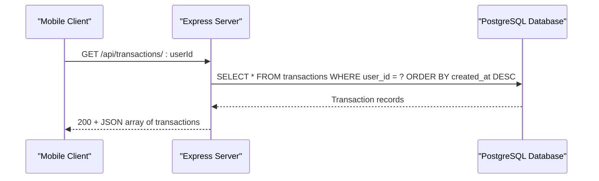
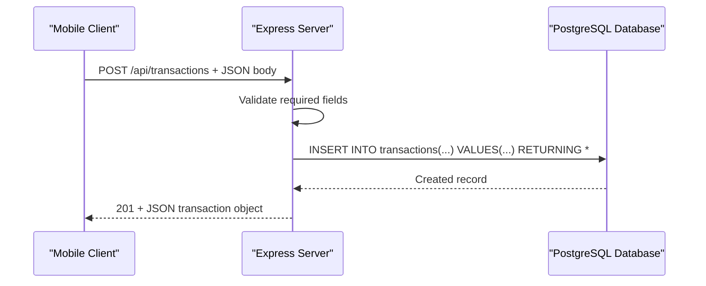
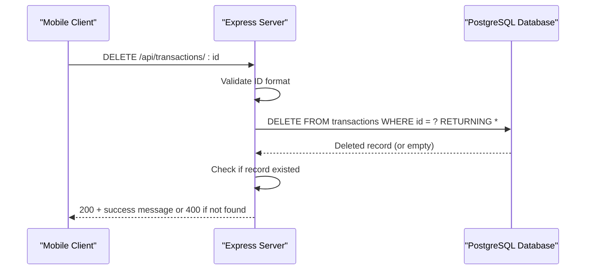
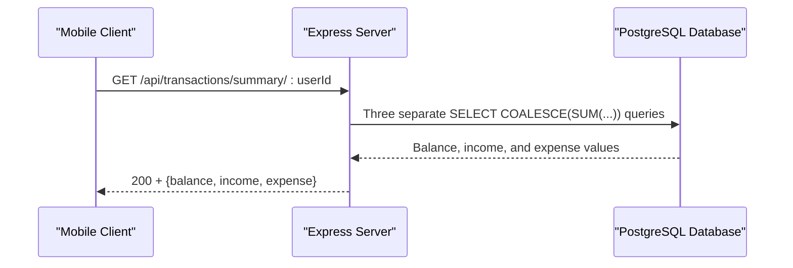
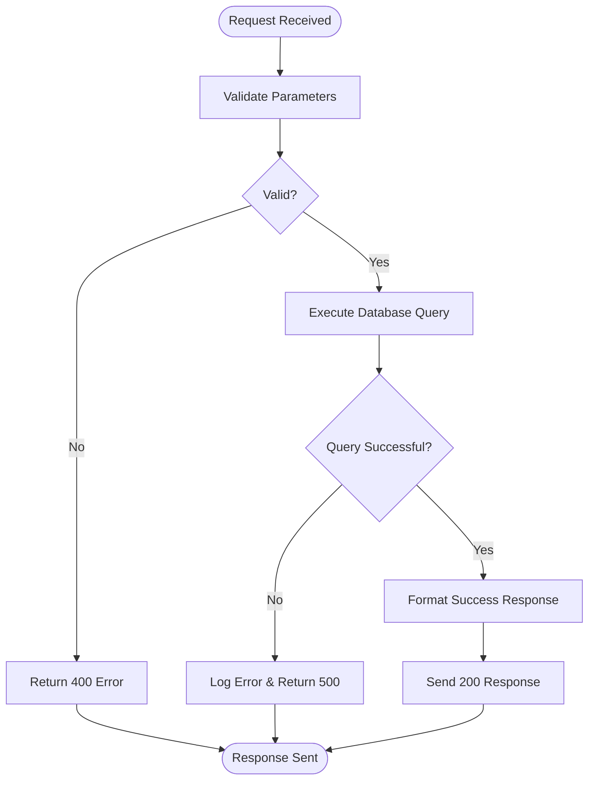

# API Reference

<cite>
**Referenced Files in This Document**   
- [transactionsRoute.js](file://backend/src/routes/transactionsRoute.js#L1-L13)
- [transactionsController.js](file://backend/src/controllers/transactionsController.js#L1-L90)
- [upstash.js](file://backend/src/config/upstash.js#L1-L9)
- [rateLimiter.js](file://backend/src/middleware/rateLimiter.js#L1-L30)
- [useTransactions.js](file://mobile/hooks/useTransactions.js#L1-L70)
- [api.js](file://mobile/constants/api.js#L1-L11)
</cite>

## Table of Contents
1. [API Endpoints Overview](#api-endpoints-overview)
2. [Endpoint Details](#endpoint-details)
   - [GET /api/transactions/:userId](#get-apitransactionsuserid)
   - [POST /api/transactions](#post-apitransactions)
   - [DELETE /api/transactions/:id](#delete-apitransactionsid)
   - [GET /api/transactions/summary/:userId](#get-apitransactionssummaryuserid)
3. [Request and Response Schema Examples](#request-and-response-schema-examples)
4. [Error Handling](#error-handling)
5. [Rate Limiting](#rate-limiting)
6. [Client Implementation Guide](#client-implementation-guide)
7. [Security Considerations](#security-considerations)
8. [Versioning Implications](#versioning-implications)

## API Endpoints Overview

The expense-wallet backend exposes a set of RESTful endpoints for managing financial transactions. These endpoints allow clients to retrieve, create, delete, and summarize transaction data for a specific user. All endpoints are secured via Clerk-generated user IDs passed as path parameters, ensuring data isolation between users.

The API is built using Express.js and interacts with a PostgreSQL database through the `sql` tagged template. Transactions are stored with fields including title, amount (positive for income, negative for expenses), category, and timestamp.

**Section sources**
- [transactionsRoute.js](file://backend/src/routes/transactionsRoute.js#L1-L13)
- [transactionsController.js](file://backend/src/controllers/transactionsController.js#L1-L90)

## Endpoint Details

### GET /api/transactions/:userId

Retrieves all transactions associated with a specific user, sorted by creation date in descending order.

**Request Parameters**
- Path: `userId` (string) - Clerk-generated user identifier

**Response Format**
- Status: 200 OK
- Body: Array of transaction objects in JSON format

**Authentication Requirements**
- User identity validated via `userId` path parameter (Clerk-managed)



**Diagram sources**
- [transactionsRoute.js](file://backend/src/routes/transactionsRoute.js#L5)
- [transactionsController.js](file://backend/src/controllers/transactionsController.js#L3-L14)

**Section sources**
- [transactionsController.js](file://backend/src/controllers/transactionsController.js#L3-L14)

### POST /api/transactions

Creates a new transaction record in the database.

**Request Parameters**
- Body (JSON):
  - `user_id` (string): Clerk-generated user ID
  - `title` (string): Transaction description
  - `amount` (number): Positive for income, negative for expenses
  - `category` (string): Transaction category (e.g., "Food", "Salary")

**Response Format**
- Status: 201 Created
- Body: Created transaction object with generated `id`

**Validation**
- Returns 400 Bad Request if any required field is missing



**Diagram sources**
- [transactionsRoute.js](file://backend/src/routes/transactionsRoute.js#L7)
- [transactionsController.js](file://backend/src/controllers/transactionsController.js#L16-L37)

**Section sources**
- [transactionsController.js](file://backend/src/controllers/transactionsController.js#L16-L37)

### DELETE /api/transactions/:id

Deletes a transaction by its database ID.

**Request Parameters**
- Path: `id` (string) - Transaction record identifier

**Response Format**
- Status: 200 OK
- Body: `{message: "transaction deleted successfully"}`

**Validation**
- Returns 400 Bad Request if ID is invalid or transaction not found



**Diagram sources**
- [transactionsRoute.js](file://backend/src/routes/transactionsRoute.js#L9)
- [transactionsController.js](file://backend/src/controllers/transactionsController.js#L39-L58)

**Section sources**
- [transactionsController.js](file://backend/src/controllers/transactionsController.js#L39-L58)

### GET /api/transactions/summary/:userId

Calculates financial summary metrics for a user.

**Request Parameters**
- Path: `userId` (string) - Clerk-generated user identifier

**Response Format**
- Status: 200 OK
- Body (JSON):
  - `balance`: Sum of all transaction amounts
  - `income`: Sum of positive amounts
  - `expense`: Sum of negative amounts (as positive value)



**Diagram sources**
- [transactionsRoute.js](file://backend/src/routes/transactionsRoute.js#L11)
- [transactionsController.js](file://backend/src/controllers/transactionsController.js#L60-L89)

**Section sources**
- [transactionsController.js](file://backend/src/controllers/transactionsController.js#L60-L89)

## Request and Response Schema Examples

**Transaction Object Schema**
```json
{
  "id": 123,
  "user_id": "clerk_user_abc123",
  "title": "Grocery Shopping",
  "amount": -85.50,
  "category": "Food",
  "created_at": "2024-01-15T08:30:00.000Z"
}
```

**Summary Response Schema**
```json
{
  "balance": 1250.75,
  "income": 3000.00,
  "expense": 1749.25
}
```

**Create Transaction Request Body**
```json
{
  "user_id": "clerk_user_abc123",
  "title": "Monthly Salary",
  "amount": 3000.00,
  "category": "Income"
}
```

**Section sources**
- [transactionsController.js](file://backend/src/controllers/transactionsController.js#L16-L37)

## Error Handling

The API implements consistent error handling patterns:

**Common Error Responses**
- **400 Bad Request**: Missing required fields or invalid transaction ID
  ```json
  {"message": "All fields are required"}
  ```
- **404 Not Found**: Transaction ID does not exist (handled as 400 in current implementation)
  ```json
  {"message": "transaction not found"}
  ```
- **429 Too Many Requests**: Rate limit exceeded
  ```json
  {"message": "too many request , please try again later "}
  ```
- **500 Internal Server Error**: Database or server-side issues
  ```json
  {"message": "internal server error"}
  ```

**Error Handling Implementation**
- All controller functions use try-catch blocks
- Database errors are caught and converted to 500 responses
- Input validation prevents incomplete data insertion



**Diagram sources**
- [transactionsController.js](file://backend/src/controllers/transactionsController.js#L3-L90)

**Section sources**
- [transactionsController.js](file://backend/src/controllers/transactionsController.js#L3-L90)

## Rate Limiting

The API implements rate limiting using Upstash Redis to prevent abuse.

**Configuration**
- **Provider**: Upstash Redis
- **Limit**: 50 requests per 60 seconds (sliding window)
- **Key**: Static key "my-rate-limit" (development configuration)

**Implementation**
- Rate limiter middleware applied globally
- Uses `@upstash/ratelimit` and `@upstash/redis` packages
- Returns 429 status when limit is exceeded

```javascript
const ratelimit = new Ratelimit({
  redis: Redis.fromEnv(),
  limiter: Ratelimit.slidingWindow(50,"60 s")
})
```

**Current Limitations**
- Uses a static key rather than user-specific or IP-based keys
- Not suitable for production without modification to use `userId` or IP address

**Section sources**
- [upstash.js](file://backend/src/config/upstash.js#L1-L9)
- [rateLimiter.js](file://backend/src/middleware/rateLimiter.js#L1-L30)

## Client Implementation Guide

### Mobile Client (React Native)

The mobile application uses a custom hook `useTransactions.js` to interact with the API.

**Key Implementation Details**
- **API URL Configuration**: Uses different endpoints for web vs. mobile platforms
- **Data Fetching**: `fetchTransactions()` and `fetchSummary()` functions
- **State Management**: React hooks (`useState`, `useCallback`) for local state
- **Error Handling**: Try-catch blocks with console logging
- **User Feedback**: React Native Alert for success/error messages

**Hook Usage Example**
```javascript
const { transactions, summary, isLoading, loadData, deleteTransaction } = useTransactions(userId);
```

**API URL Configuration**
```javascript
export const API_URL = Platform.OS === 'web' 
  ? "http://localhost:5001/api"
  : "http://10.62.106.16:5001/api";
```

**Section sources**
- [useTransactions.js](file://mobile/hooks/useTransactions.js#L1-L70)
- [api.js](file://mobile/constants/api.js#L1-L11)

### Web Client Guidelines

For web implementations, consider the following:

**Recommended Practices**
- Use environment variables for API URLs
- Implement proper authentication headers if upgrading from path-based user identification
- Add loading states and error boundaries
- Implement caching mechanisms for better performance
- Use TypeScript interfaces for type safety

**Example Fetch Call**
```javascript
const response = await fetch(`${API_URL}/transactions/${userId}`, {
  method: 'GET',
  headers: {
    'Content-Type': 'application/json',
  },
});
```

## Security Considerations

**Current Security Model**
- User data isolation via `userId` path parameter
- No additional authentication layer (relies on client passing correct Clerk user ID)
- SQL queries use parameterized statements (via `sql` template) preventing SQL injection

**Security Risks**
- **IDOR Vulnerability**: Users could access other users' data by changing the `userId` parameter
- **Rate Limiting**: Uses static key, making it ineffective for per-user protection
- **No Authentication**: API endpoints are publicly accessible if URL is known

**Recommendations**
- Implement proper authentication middleware (e.g., JWT validation)
- Use HTTP headers instead of path parameters for user identification
- Upgrade rate limiting to use user-specific keys
- Add CORS restrictions in production
- Implement input sanitization beyond basic validation

**Section sources**
- [transactionsController.js](file://backend/src/controllers/transactionsController.js#L3-L90)
- [rateLimiter.js](file://backend/src/middleware/rateLimiter.js#L1-L30)

## Versioning Implications

**Current Versioning Status**
- No explicit versioning in API routes (e.g., no `/v1/` prefix)
- Changes to endpoints would break existing clients

**Recommended Versioning Strategy**
- Implement URL-based versioning: `/api/v1/transactions`
- Maintain backward compatibility for at least one major version
- Use semantic versioning for API releases
- Document breaking changes clearly

**Migration Considerations**
- Client applications would need updates for any endpoint changes
- The mobile app's `useTransactions.js` hook would require modification if base URL changes
- Consider implementing API gateway for future version routing

**Section sources**
- [transactionsRoute.js](file://backend/src/routes/transactionsRoute.js#L1-L13)
- [useTransactions.js](file://mobile/hooks/useTransactions.js#L1-L70)