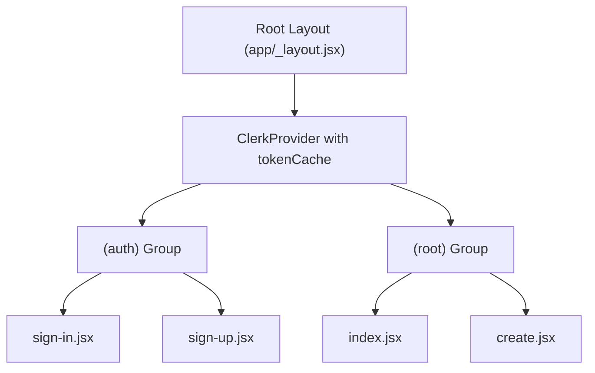
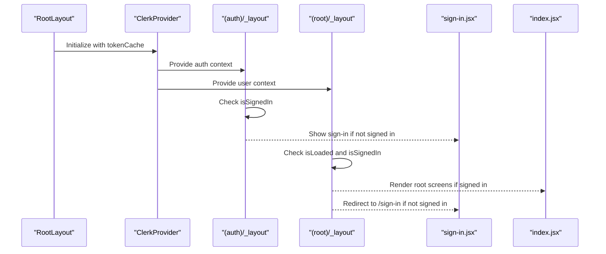

# Authentication Flow

<cite>
**Referenced Files in This Document**   
- [mobile/app/(auth)/_layout.jsx](file://mobile/app/(auth)/_layout.jsx#L1-L11)
- [mobile/app/(root)/_layout.jsx](file://mobile/app/(root)/_layout.jsx#L1-L12)
- [mobile/app/_layout.jsx](file://mobile/app/_layout.jsx#L1-L16)
- [mobile/app/(auth)/sign-in.jsx](file://mobile/app/(auth)/sign-in.jsx#L1-L121)
- [mobile/app/(auth)/sign-up.jsx](file://mobile/app/(auth)/sign-up.jsx)
- [mobile/expo-env.d.ts](file://mobile/expo-env.d.ts#L1-L2)
</cite>

## Table of Contents
1. [Introduction](#introduction)
2. [Project Structure](#project-structure)
3. [Core Components](#core-components)
4. [Architecture Overview](#architecture-overview)
5. [Authentication Flow Analysis](#authentication-flow-analysis)
6. [Token Management and Persistence](#token-management-and-persistence)
7. [Route Protection and Navigation Logic](#route-protection-and-navigation-logic)
8. [Environment Configuration](#environment-configuration)
9. [Error Handling and Common Issues](#error-handling-and-common-issues)
10. [Conclusion](#conclusion)

## Introduction
This document provides a comprehensive analysis of the authentication system implemented in the mobile application using Clerk. It details the integration of Clerk for user sign-in and sign-up, secure token caching, route protection, and state management. The authentication flow ensures that only authenticated users can access protected routes under the `(root)` group, while unauthenticated users are redirected to the authentication screens in the `(auth)` group.

**Section sources**
- [mobile/app/(auth)/_layout.jsx](file://mobile/app/(auth)/_layout.jsx#L1-L11)
- [mobile/app/(root)/_layout.jsx](file://mobile/app/(root)/_layout.jsx#L1-L12)

## Project Structure
The project follows a feature-based organization with two primary route groups: `(auth)` and `(root)`. The `(auth)` group contains authentication screens such as sign-in and sign-up, while the `(root)` group houses the main application screens accessible only after successful authentication.

The root `_layout.jsx` wraps the entire app with `ClerkProvider`, enabling authentication context across all screens. Each route group has its own layout file that controls navigation flow based on authentication state.



**Diagram sources**
- [mobile/app/_layout.jsx](file://mobile/app/_layout.jsx#L1-L16)
- [mobile/app/(auth)/_layout.jsx](file://mobile/app/(auth)/_layout.jsx#L1-L11)
- [mobile/app/(root)/_layout.jsx](file://mobile/app/(root)/_layout.jsx#L1-L12)

## Core Components
The core components of the authentication system include:
- **ClerkProvider**: Wraps the app and provides authentication context.
- **useAuth** and **useUser**: React hooks from `@clerk/clerk-expo` to access authentication state.
- **tokenCache**: Secure storage mechanism for persisting authentication tokens.
- **Redirect**: Component from `expo-router` used to navigate between auth and root routes.
- **Stack Navigator**: Manages screen transitions within route groups.

These components work together to manage user sessions, protect routes, and ensure seamless navigation.

**Section sources**
- [mobile/app/_layout.jsx](file://mobile/app/_layout.jsx#L1-L16)
- [mobile/app/(auth)/_layout.jsx](file://mobile/app/(auth)/_layout.jsx#L1-L11)
- [mobile/app/(root)/_layout.jsx](file://mobile/app/(root)/_layout.jsx#L1-L12)

## Architecture Overview
The authentication architecture is built around Clerk’s Expo SDK, which handles user identity, session management, and secure token storage. The app uses Expo Router’s file-based routing with layout wrappers to control access based on authentication status.

At startup, the `RootLayout` initializes `ClerkProvider` with `tokenCache`, making authentication available throughout the app. The `(auth)` and `(root)` layouts use `useAuth` and `useUser` to determine whether the user is signed in and redirect accordingly.



**Diagram sources**
- [mobile/app/_layout.jsx](file://mobile/app/_layout.jsx#L1-L16)
- [mobile/app/(auth)/_layout.jsx](file://mobile/app/(auth)/_layout.jsx#L1-L11)
- [mobile/app/(root)/_layout.jsx](file://mobile/app/(root)/_layout.jsx#L1-L12)

## Authentication Flow Analysis
The authentication flow begins when an unauthenticated user opens the app. The `(root)` layout checks the authentication state via `useUser()`. If the user is not signed in, they are redirected to `/sign-in`.

Once on the sign-in screen, the user enters their email and password. Upon submission, `useSignIn().create()` is called with the credentials. Clerk validates the input and returns a `signInAttempt` object.

If the attempt status is `"complete"`, the session is activated using `setActive()`, and the user is redirected to the home screen (`/`). Otherwise, the app handles partial sign-in states (e.g., multi-factor authentication) or displays errors.

```mermaid
flowchart TD
Start([App Launch]) --> CheckAuth[Check Authentication State]
CheckAuth --> IsSignedIn{"User Signed In?"}
IsSignedIn --> |No| RedirectToSignIn[Redirect to /sign-in]
IsSignedIn --> |Yes| LoadRoot[Load (root) Routes]
RedirectToSignIn --> SignInScreen[Render sign-in.jsx]
SignInScreen --> SubmitCredentials[Submit Email & Password]
SubmitCredentials --> CallSignInAPI[Call signIn.create()]
CallSignInAPI --> Validate[Validate Credentials via Clerk]
Validate --> StatusCheck{"Status = 'complete'?"}
StatusCheck --> |Yes| ActivateSession[setActive(sessionId)]
StatusCheck --> |No| HandleMFA[Handle Additional Steps]
ActivateSession --> RedirectHome[Redirect to /]
HandleMFA --> ShowInstructions[Show MFA Prompt]
```

**Diagram sources**
- [mobile/app/(auth)/sign-in.jsx](file://mobile/app/(auth)/sign-in.jsx#L1-L121)
- [mobile/app/(root)/_layout.jsx](file://mobile/app/(root)/_layout.jsx#L1-L12)

**Section sources**
- [mobile/app/(auth)/sign-in.jsx](file://mobile/app/(auth)/sign-in.jsx#L1-L121)
- [mobile/app/(root)/_layout.jsx](file://mobile/app/(root)/_layout.jsx#L1-L12)

## Token Management and Persistence
Secure token persistence is achieved using Clerk’s `tokenCache` from `@clerk/clerk-expo/token-cache`. This utility automatically handles secure storage of JWTs using platform-specific secure storage (e.g., Keychain on iOS, Keystore on Android).

The `ClerkProvider` at the root layout level accepts `tokenCache` as a prop, enabling automatic retrieval and storage of tokens across app restarts. This ensures that users remain authenticated unless explicitly signed out or their session expires.

Token refresh is handled transparently by Clerk, reducing the need for manual intervention. Developers do not need to manually manage token expiration in most cases.

**Section sources**
- [mobile/app/_layout.jsx](file://mobile/app/_layout.jsx#L1-L16)

## Route Protection and Navigation Logic
Route protection is implemented through layout-level authentication checks:

- **(auth)/_layout.jsx**: Uses `useAuth().isSignedIn` to check if the user is already authenticated. If so, it redirects to `/` using `<Redirect href="/" />`.
- **(root)/_layout.jsx**: Uses `useUser()` to check both `isLoaded` and `isSignedIn`. While loading, it returns `null`. If not signed in, it redirects to `/sign-in`.

This dual-layer approach ensures that:
1. Authenticated users cannot access sign-in/sign-up screens.
2. Unauthenticated users cannot access protected root screens.
3. The UI remains responsive during authentication state resolution.

```jsx
// Example: (root)/_layout.jsx
if (!isLoaded) return null;
if (!isSignedIn) return <Redirect href="/sign-in" />;
```

**Section sources**
- [mobile/app/(auth)/_layout.jsx](file://mobile/app/(auth)/_layout.jsx#L1-L11)
- [mobile/app/(root)/_layout.jsx](file://mobile/app/(root)/_layout.jsx#L1-L12)

## Environment Configuration
The file `expo-env.d.ts` defines global types for the Expo environment. While it does not contain environment variable declarations directly, it indicates that environment configuration is managed externally and should not be committed to version control.

Best practices suggest storing Clerk-related environment variables (e.g., `CLERK_PUBLISHABLE_KEY`) in `.env` files, which are referenced in native configuration files (`app.json`, `metro.config.js`). These keys are used by Clerk to identify the application instance during authentication.

Although the current `expo-env.d.ts` is minimal, it serves as a placeholder for future type definitions related to environment variables.

**Section sources**
- [mobile/expo-env.d.ts](file://mobile/expo-env.d.ts#L1-L2)

## Error Handling and Common Issues
Common issues in the authentication flow include:

- **Token Expiration**: Clerk automatically handles token refresh. If refresh fails, the user is redirected to sign-in.
- **Caching Failures**: If `tokenCache` fails to read/write, the user may be forced to re-authenticate. This is rare due to Clerk’s robust secure storage implementation.
- **Network Errors**: Clerk SDK retries failed requests internally. Persistent failures result in error states displayed to the user.
- **Incorrect Password**: Handled in `sign-in.jsx` with specific error code checking (`form_password_incorrect`).
- **Platform-Specific Behavior**: Biometric authentication or social login may behave differently across iOS and Android. Clerk abstracts most of these differences.

Error messages are localized and user-friendly, avoiding exposure of sensitive system details.

```jsx
// Example error handling in sign-in.jsx
if (err.errors?.[0]?.code === "form_password_incorrect") {
  setError("Password is incorrect. Please try again.");
} else {
  setError("An error occurred. Please try again.");
}
```

**Section sources**
- [mobile/app/(auth)/sign-in.jsx](file://mobile/app/(auth)/sign-in.jsx#L1-L121)

## Conclusion
The authentication system in this application leverages Clerk’s robust identity platform to provide secure, scalable, and developer-friendly user management. By integrating `ClerkProvider`, `tokenCache`, and Expo Router’s layout-based navigation, the app ensures a seamless and secure user experience.

Key strengths include:
- Automatic token persistence and refresh
- Declarative route protection
- Clear separation of auth and root routes
- Built-in error handling and user feedback

Developers can extend this system by adding social login providers, customizing the UI, or implementing role-based access control using Clerk’s metadata features.