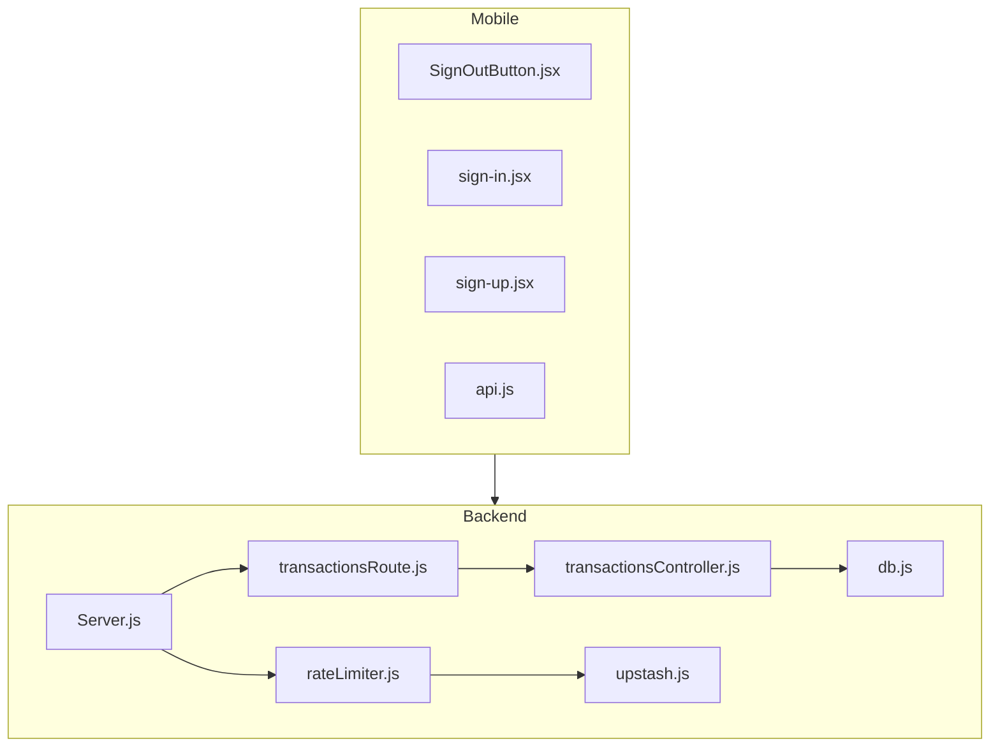
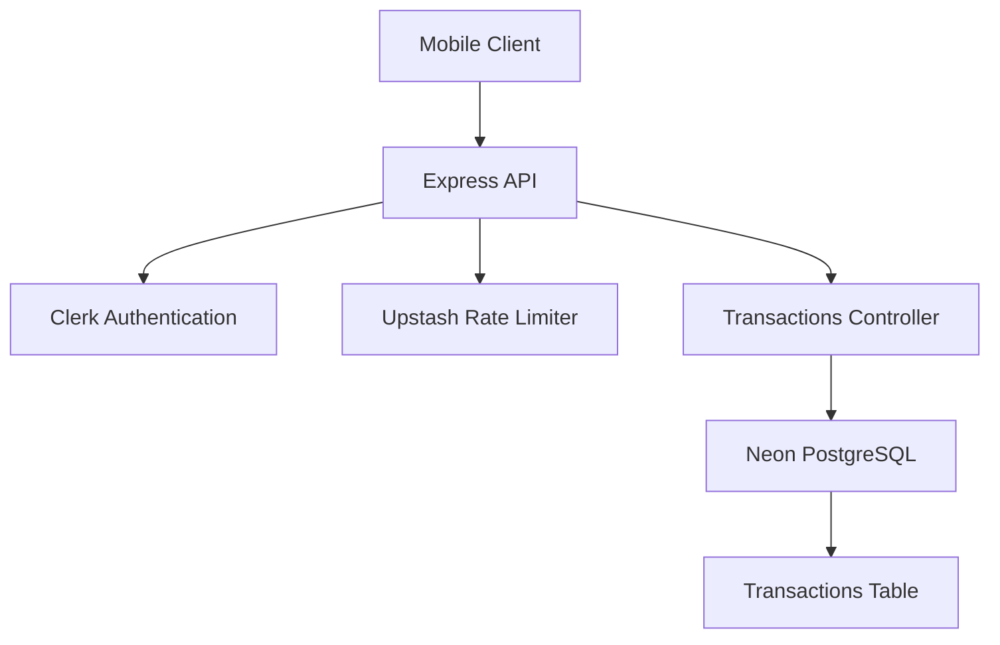
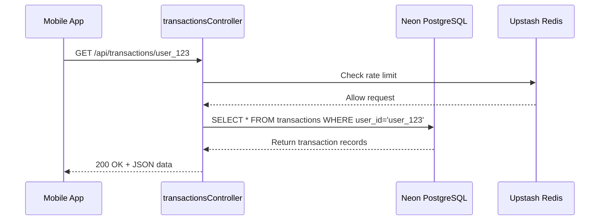
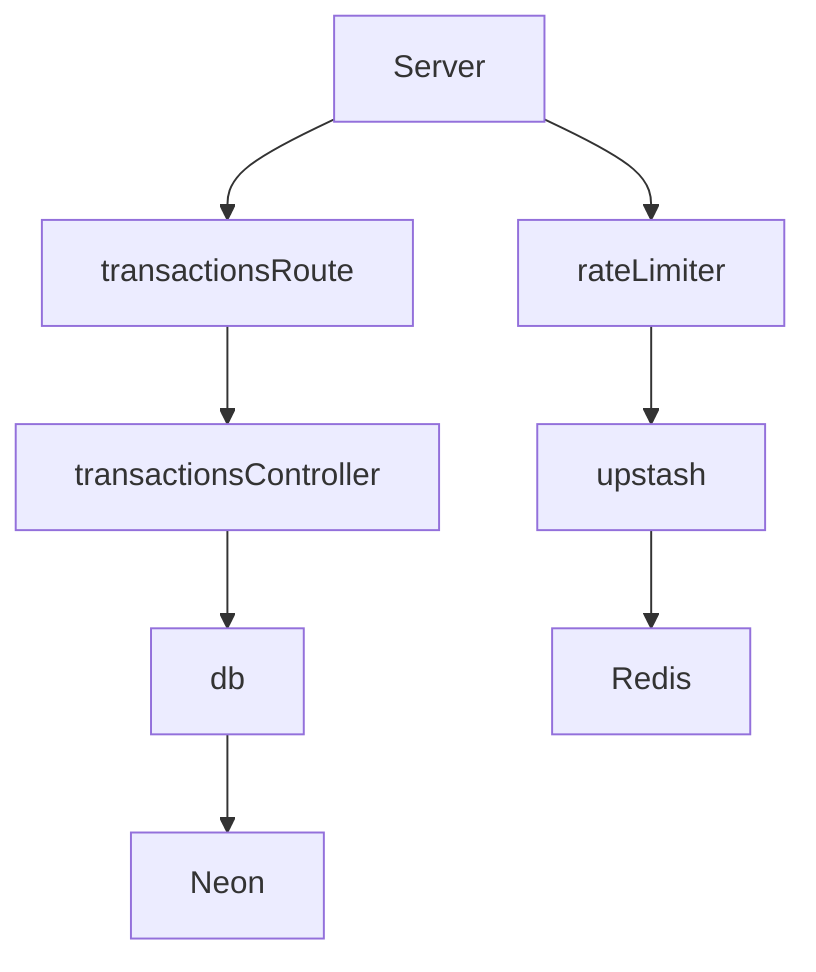

# API Endpoints

<cite>
**Referenced Files in This Document**   
- [transactionsRoute.js](file://backend/src/routes/transactionsRoute.js#L1-L13)
- [transactionsController.js](file://backend/src/controllers/transactionsController.js#L1-L90)
- [db.js](file://backend/src/config/db.js#L1-L27)
- [upstash.js](file://backend/src/config/upstash.js#L1-L9)
- [rateLimiter.js](file://backend/src/middleware/rateLimiter.js#L1-L30)
- [Server.js](file://backend/src/Server.js#L1-L37)
</cite>

## Table of Contents
1. [Introduction](#introduction)
2. [Project Structure](#project-structure)
3. [Core Components](#core-components)
4. [Architecture Overview](#architecture-overview)
5. [Detailed Component Analysis](#detailed-component-analysis)
6. [Dependency Analysis](#dependency-analysis)
7. [Performance Considerations](#performance-considerations)
8. [Troubleshooting Guide](#troubleshooting-guide)
9. [Conclusion](#conclusion)

## Introduction
This document provides comprehensive API documentation for the transaction management endpoints in the **expense-wallet** backend system. The API enables users to manage financial transactions, including creating, retrieving, summarizing, and deleting records. Built on Node.js with Express, the backend uses Neon PostgreSQL for data persistence and Upstash Redis for rate limiting. Authentication is handled via Clerk on the mobile frontend, ensuring secure access to user-specific data. This documentation details each endpoint's functionality, request/response structure, error handling, and integration considerations.

## Project Structure
The project is organized into two main directories: `backend` and `mobile`. The backend implements RESTful API endpoints for transaction management, while the mobile application provides a React Native interface for user interaction.



**Diagram sources**
- [Server.js](file://backend/src/Server.js#L1-L37)
- [transactionsRoute.js](file://backend/src/routes/transactionsRoute.js#L1-L13)

**Section sources**
- [Server.js](file://backend/src/Server.js#L1-L37)
- [transactionsRoute.js](file://backend/src/routes/transactionsRoute.js#L1-L13)

## Core Components
The core functionality revolves around transaction data management. Key components include route definitions, controllers for business logic, database configuration, and middleware for security and performance.

**Section sources**
- [transactionsController.js](file://backend/src/controllers/transactionsController.js#L1-L90)
- [db.js](file://backend/src/config/db.js#L1-L27)

## Architecture Overview
The system follows a layered architecture with clear separation of concerns:
- **Frontend (Mobile)**: React Native app using Clerk for authentication
- **API Layer**: Express.js routes handling HTTP requests
- **Business Logic**: Controller functions processing requests
- **Data Access**: Neon PostgreSQL database with parameterized queries
- **Infrastructure**: Upstash Redis for rate limiting, environment variables for configuration



**Diagram sources**
- [Server.js](file://backend/src/Server.js#L1-L37)
- [transactionsController.js](file://backend/src/controllers/transactionsController.js#L1-L90)
- [db.js](file://backend/src/config/db.js#L1-L27)

## Detailed Component Analysis

### Transaction Management Endpoints
The transaction API provides four key endpoints for managing user financial data.

#### GET /api/transactions/:userId
Retrieves all transactions for a specific user.

**Request Details**
- **Method**: GET
- **URL**: `/api/transactions/:userId`
- **Headers**: 
  - `Authorization: Bearer <token>` (via Clerk)
  - `Content-Type: application/json`
- **Path Parameters**:
  - `userId`: string (required) - Unique identifier for the user

**Response Format**
```json
[
  {
    "id": 1,
    "user_id": "user_123",
    "title": "Grocery Shopping",
    "amount": -85.50,
    "category": "Food",
    "created_at": "2024-01-15"
  }
]
```

**Error Responses**
- `400 Bad Request`: Invalid userId format
- `500 Internal Server Error`: Database connection failure

**Section sources**
- [transactionsRoute.js](file://backend/src/routes/transactionsRoute.js#L4-L5)
- [transactionsController.js](file://backend/src/controllers/transactionsController.js#L3-L15)

#### POST /api/transactions
Creates a new transaction record.

**Request Details**
- **Method**: POST
- **URL**: `/api/transactions`
- **Headers**: 
  - `Authorization: Bearer <token>`
  - `Content-Type: application/json`
- **Request Body**:
```json
{
  "title": "string (required)",
  "amount": "number (required)",
  "category": "string (required)",
  "user_id": "string (required)"
}
```

**Validation Rules**
- All fields are mandatory
- Amount must be a valid number (positive for income, negative for expense)

**Response Format**
```json
{
  "id": 2,
  "user_id": "user_123",
  "title": "Freelance Payment",
  "amount": 500.00,
  "category": "Income",
  "created_at": "2024-01-16"
}
```

**Error Responses**
- `400 Bad Request`: Missing required fields
- `500 Internal Server Error`: Database insertion failure

**Section sources**
- [transactionsRoute.js](file://backend/src/routes/transactionsRoute.js#L6-L7)
- [transactionsController.js](file://backend/src/controllers/transactionsController.js#L17-L37)

#### DELETE /api/transactions/:id
Removes a transaction by its ID.

**Request Details**
- **Method**: DELETE
- **URL**: `/api/transactions/:id`
- **Headers**: 
  - `Authorization: Bearer <token>`
- **Path Parameters**:
  - `id`: number (required) - Transaction identifier

**Response Format**
```json
{
  "message": "transaction deleted successfully"
}
```

**Error Responses**
- `400 Bad Request`: Invalid transaction ID or transaction not found
- `500 Internal Server Error`: Database deletion failure

**Section sources**
- [transactionsRoute.js](file://backend/src/routes/transactionsRoute.js#L8-L9)
- [transactionsController.js](file://backend/src/controllers/transactionsController.js#L39-L58)

#### GET /api/transactions/summary/:userId
Retrieves financial summary for a user.

**Request Details**
- **Method**: GET
- **URL**: `/api/transactions/summary/:userId`
- **Headers**: 
  - `Authorization: Bearer <token>`
- **Path Parameters**:
  - `userId`: string (required)

**Response Format**
```json
{
  "balance": 414.50,
  "income": 500.00,
  "expense": 85.50
}
```

**Calculation Logic**
- **Balance**: Sum of all transaction amounts
- **Income**: Sum of positive amounts
- **Expense**: Sum of negative amounts (returned as positive value)

**Error Responses**
- `500 Internal Server Error`: Database query failure

**Section sources**
- [transactionsRoute.js](file://backend/src/routes/transactionsRoute.js#L10-L11)
- [transactionsController.js](file://backend/src/controllers/transactionsController.js#L60-L88)

### Data Flow Analysis
The sequence of operations when retrieving transaction data:



**Diagram sources**
- [transactionsController.js](file://backend/src/controllers/transactionsController.js#L3-L15)
- [db.js](file://backend/src/config/db.js#L1-L27)
- [rateLimiter.js](file://backend/src/middleware/rateLimiter.js#L1-L30)

### Security and Validation
The system implements multiple security layers to protect data integrity and prevent abuse.

#### Input Validation
All endpoints validate input data:
- Required fields are checked (title, amount, category, user_id)
- Transaction ID is validated as a number
- User identity is verified through the userId parameter

#### SQL Injection Prevention
The application uses parameterized queries via the `sql` template tag from `@neondatabase/serverless`, which automatically escapes inputs and prevents SQL injection attacks.

```javascript
// Safe parameterized query
const transactions = await sql`
  SELECT * FROM transactions 
  WHERE user_id = ${userId} 
  ORDER BY created_at DESC
`;
```

#### Rate Limiting
Implemented using Upstash Redis with a sliding window algorithm:
- **Limit**: 50 requests per 60 seconds
- **Key**: Fixed string "my-rate-limit" (simplified for demo)
- **Response**: 429 Too Many Requests when exceeded

**Section sources**
- [db.js](file://backend/src/config/db.js#L1-L27)
- [upstash.js](file://backend/src/config/upstash.js#L1-L9)
- [rateLimiter.js](file://backend/src/middleware/rateLimiter.js#L1-L30)

## Dependency Analysis
The backend system has well-defined dependencies between components.



**Diagram sources**
- [Server.js](file://backend/src/Server.js#L1-L37)
- [transactionsRoute.js](file://backend/src/routes/transactionsRoute.js#L1-L13)
- [transactionsController.js](file://backend/src/controllers/transactionsController.js#L1-L90)

**Section sources**
- [Server.js](file://backend/src/Server.js#L1-L37)
- [package.json](file://backend/package.json)

## Performance Considerations
The system includes several performance optimization strategies:

- **Database Indexing**: The transactions table should have indexes on `user_id` and `created_at` columns for faster queries
- **Connection Pooling**: Neon PostgreSQL handles connection pooling automatically
- **Rate Limiting**: Upstash Redis prevents API abuse and ensures fair usage
- **Efficient Queries**: Each summary endpoint uses optimized SQL with COALESCE to handle null values
- **Caching Strategy**: Consider implementing response caching for summary data in production

For mobile clients, implement:
- Data pagination for transaction lists
- Local caching of transaction data
- Background synchronization
- Error retry mechanisms with exponential backoff

## Troubleshooting Guide
Common issues and their solutions:

**400 Bad Request**
- **Cause**: Missing required fields in POST request
- **Solution**: Ensure all fields (title, amount, category, user_id) are included

**404 Not Found**
- **Cause**: Not applicable (endpoints return 400 for invalid IDs)
- **Note**: DELETE returns 400 if transaction not found

**429 Too Many Requests**
- **Cause**: Rate limit exceeded (50 requests/minute)
- **Solution**: Implement client-side throttling or wait before retrying

**500 Internal Server Error**
- **Cause**: Database connection failure or query error
- **Solution**: Check database connection string and service availability

**Authentication Issues**
- Ensure Clerk token is included in Authorization header
- Verify user is properly signed in on the mobile app

**Section sources**
- [transactionsController.js](file://backend/src/controllers/transactionsController.js#L1-L90)
- [Server.js](file://backend/src/Server.js#L1-L37)

## Conclusion
The expense-wallet transaction API provides a robust foundation for managing personal financial data. With secure authentication via Clerk, reliable data persistence in Neon PostgreSQL, and protection against abuse through Upstash rate limiting, the system balances functionality with security. The clean separation of concerns in the codebase makes it maintainable and extensible. For production deployment, consider enhancing the rate limiting strategy to use user-specific keys and implementing more sophisticated error logging and monitoring.