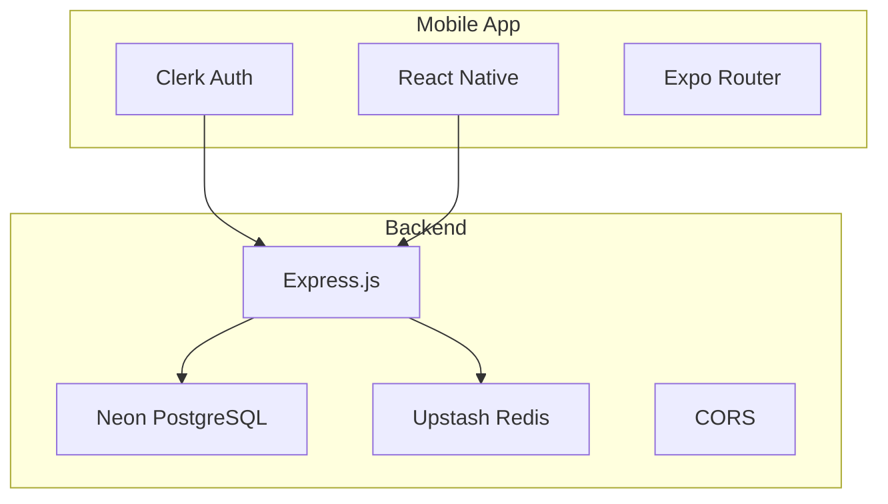
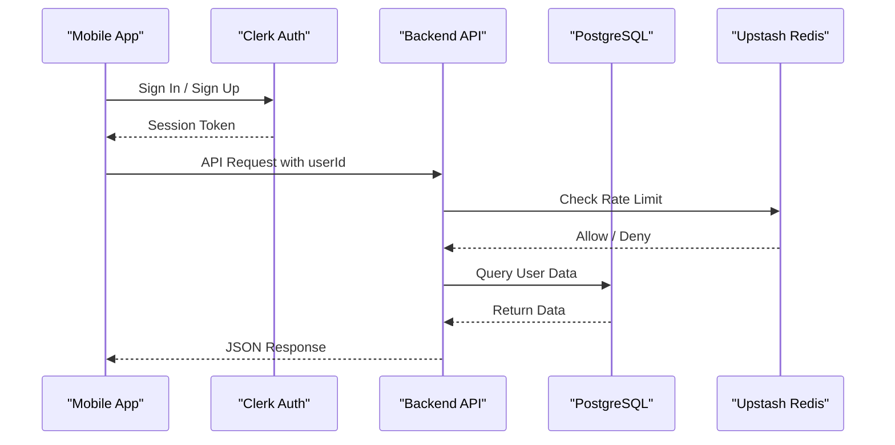
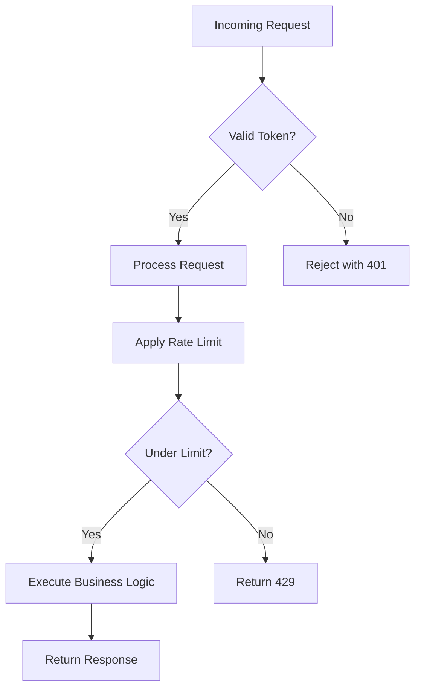

# Authentication Flow

<cite>
**Referenced Files in This Document**   
- [Server.js](file://backend/src/Server.js#L1-L38)
- [transactionsRoute.js](file://backend/src/routes/transactionsRoute.js#L1-L13)
- [transactionsController.js](file://backend/src/controllers/transactionsController.js#L1-L90)
- [rateLimiter.js](file://backend/src/middleware/rateLimiter.js#L1-L30)
- [upstash.js](file://backend/src/config/upstash.js#L1-L9)
- [db.js](file://backend/src/config/db.js#L1-L27)
- [sign-in.jsx](file://mobile/app/(auth)/sign-in.jsx#L1-L70)
- [sign-up.jsx](file://mobile/app/(auth)/sign-up.jsx#L1-L70)
- [SignOutButton.jsx](file://mobile/components/SignOutButton.jsx#L1-L20)
- [package-lock.json](file://mobile/package-lock.json#L1537-L1685)
</cite>

## Table of Contents
1. [Authentication Flow](#authentication-flow)
2. [Project Structure](#project-structure)
3. [Core Components](#core-components)
4. [Architecture Overview](#architecture-overview)
5. [Authentication and Authorization Flow](#authentication-and-authorization-flow)
6. [Trust Model and Security Assumptions](#trust-model-and-security-assumptions)
7. [Rate Limiting Implementation](#rate-limiting-implementation)
8. [Security Recommendations and Future Enhancements](#security-recommendations-and-future-enhancements)
9. [Conclusion](#conclusion)

## Project Structure

The project is structured into two main directories: `backend` and `mobile`. The backend is built using Node.js with Express.js, while the mobile frontend uses React Native with Expo.



**Diagram sources**
- [Server.js](file://backend/src/Server.js#L1-L38)
- [sign-in.jsx](file://mobile/app/(auth)/sign-in.jsx#L1-L70)

## Core Components

The core components of the authentication and authorization system include:

- **Clerk Integration**: Handles user sign-up, sign-in, and session management on the mobile frontend.
- **Express.js Backend**: Serves RESTful API endpoints for transaction management.
- **Token-Based Authentication**: User identity is passed via `userId` in API requests.
- **Rate Limiting**: Implemented using Upstash Redis to prevent abuse.

**Section sources**
- [Server.js](file://backend/src/Server.js#L1-L38)
- [transactionsController.js](file://backend/src/controllers/transactionsController.js#L1-L90)
- [rateLimiter.js](file://backend/src/middleware/rateLimiter.js#L1-L30)

## Architecture Overview

The system follows a client-server architecture where the mobile app communicates with the backend via HTTP requests. Clerk manages authentication on the frontend, and the backend trusts the `userId` provided in the request parameters.



**Diagram sources**
- [Server.js](file://backend/src/Server.js#L1-L38)
- [sign-in.jsx](file://mobile/app/(auth)/sign-in.jsx#L1-L70)
- [transactionsController.js](file://backend/src/controllers/transactionsController.js#L1-L90)

## Authentication and Authorization Flow

The authentication flow begins on the mobile app using Clerk for user sign-in and sign-up. Once authenticated, the user's `userId` is extracted from the Clerk session and included in all subsequent API requests to the backend.

### Sign-In Process

When a user signs in:
1. The mobile app uses `@clerk/clerk-expo` to initiate the sign-in process.
2. Upon successful authentication, Clerk returns a session token.
3. The app retrieves the `userId` from the authenticated session.
4. This `userId` is passed as a URL parameter in API requests (e.g., `/api/transactions/:userId`).

```javascript
// Example from sign-in.jsx
const onSignInPress = async () => {
  const signInAttempt = await signIn.create({
    identifier: emailAddress,
    password,
  });

  if (signInAttempt.status === "complete") {
    await setActive({ session: signInAttempt.createdSessionId });
    router.replace("/");
  }
};
```

### API Request Flow

Each API endpoint in the backend validates the presence of `userId` and uses it to scope data access:

```javascript
// transactionsController.js
export async function getTransactionByUserId(req, res) {
  const { userId } = req.params;
  const transactions = await sql`
    SELECT * FROM transactions WHERE user_id=${userId} ORDER BY created_at DESC
  `;
  res.status(200).json(transactions);
}
```

All endpoints (`GET /:userId`, `POST /`, `DELETE /:id`, `GET /summary/:userId`) rely on the `userId` parameter to ensure data isolation between users.

**Section sources**
- [sign-in.jsx](file://mobile/app/(auth)/sign-in.jsx#L1-L70)
- [transactionsController.js](file://backend/src/controllers/transactionsController.js#L1-L90)
- [transactionsRoute.js](file://backend/src/routes/transactionsRoute.js#L1-L13)

## Trust Model and Security Assumptions

The backend operates under a **trusted frontend model**, where it assumes that the `userId` passed in API requests is valid because it originates from a Clerk-managed authenticated session.

### Key Assumptions:
- The mobile app correctly extracts `userId` from the Clerk session.
- The `userId` cannot be tampered with during transmission.
- There is no server-side token verification; the backend trusts the client-provided `userId`.

This approach simplifies implementation but introduces potential risks if the mobile app is compromised or if requests are forged.

### Architectural Trade-offs:
- **Pros**: Simplicity, reduced server-side complexity, faster development.
- **Cons**: Reliance on client-side integrity, potential for ID spoofing if endpoints are exposed.

**Section sources**
- [transactionsController.js](file://backend/src/controllers/transactionsController.js#L1-L90)
- [sign-in.jsx](file://mobile/app/(auth)/sign-in.jsx#L1-L70)

## Rate Limiting Implementation

To mitigate abuse such as brute-force attacks or scraping, the backend implements rate limiting using **Upstash Redis**.

### Configuration

Rate limiting is configured globally for all `/api/*` routes:

```javascript
// upstash.js
const ratelimit = new Ratelimit({
  redis: Redis.fromEnv(),
  limiter: Ratelimit.slidingWindow(50, "60 s") // 50 requests per minute
});
```

### Middleware Application

The rate limiter is applied as middleware in `Server.js`:

```javascript
// Server.js
app.use(ratelimiter);
```

Each request is checked against the limit using a static key (`"my-rate-limit"`), meaning the limit applies globally rather than per user or IP.

```javascript
// rateLimiter.js
const { success } = await ratelimit.limit("my-rate-limit");
if (!success) {
  return res.status(429).json({ message: "too many request, please try again later" });
}
```

While this provides basic protection, it could be enhanced by using user-specific or IP-based keys for more granular control.

**Section sources**
- [upstash.js](file://backend/src/config/upstash.js#L1-L9)
- [rateLimiter.js](file://backend/src/middleware/rateLimiter.js#L1-L30)
- [Server.js](file://backend/src/Server.js#L1-L38)

## Security Recommendations and Future Enhancements

### Immediate Improvements
1. **Per-User/IP Rate Limiting**: Modify `rateLimiter.js` to use `userId` or `req.ip` as the rate limit key.
   ```javascript
   const key = req.params.userId || req.ip;
   const { success } = await ratelimit.limit(key);
   ```

2. **Input Validation**: Strengthen validation in controllers to prevent injection and malformed data.

3. **HTTPS Enforcement**: Ensure all communications are encrypted in production.

### Long-Term Enhancements
1. **JWT Validation**: Introduce JWT token verification on the backend to validate `userId` authenticity.
2. **Middleware-Based Authentication**: Create an authentication middleware that verifies tokens before processing requests.
3. **Audit Logging**: Log sensitive operations for security monitoring.
4. **CORS Configuration**: Implement strict CORS policies to restrict API access to authorized origins.



**Diagram sources**
- [rateLimiter.js](file://backend/src/middleware/rateLimiter.js#L1-L30)
- [transactionsController.js](file://backend/src/controllers/transactionsController.js#L1-L90)

## Conclusion

The current authentication flow leverages Clerk for secure user management on the mobile frontend, while the backend trusts the `userId` parameter for data scoping. This design prioritizes simplicity and rapid development but relies heavily on client-side integrity. The integration of Upstash Redis provides essential rate limiting to protect against abuse. Future improvements should focus on adding server-side token validation and more granular rate limiting to enhance security without sacrificing usability.