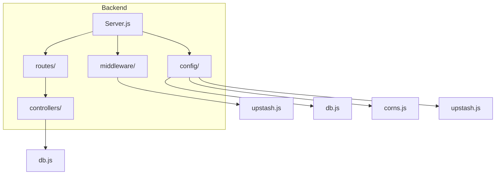
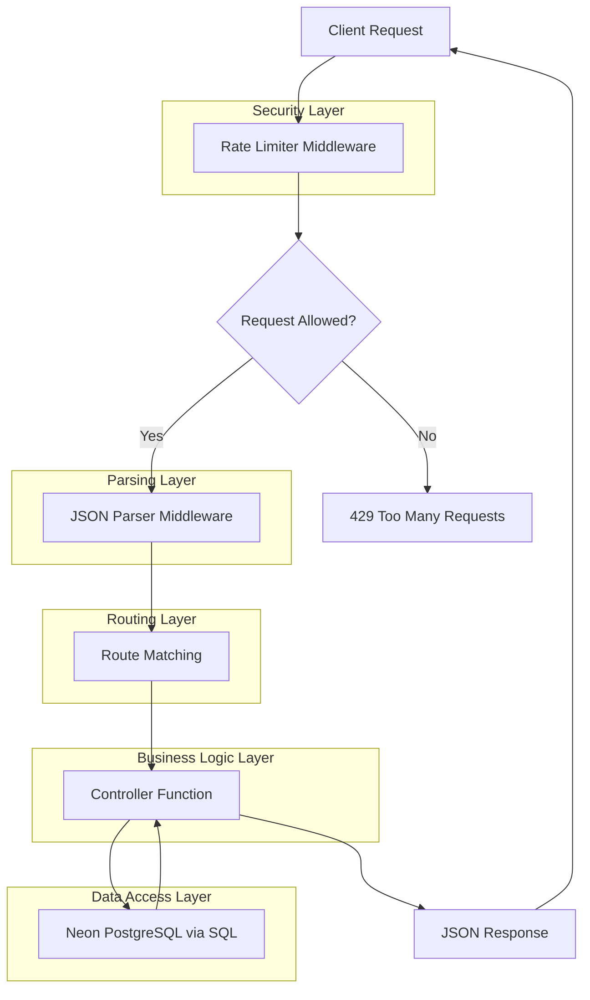
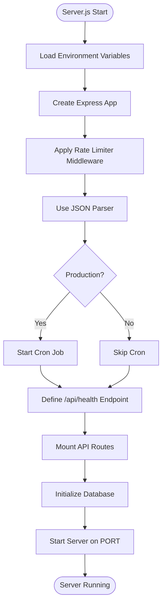
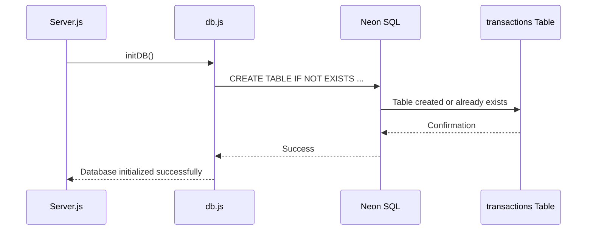
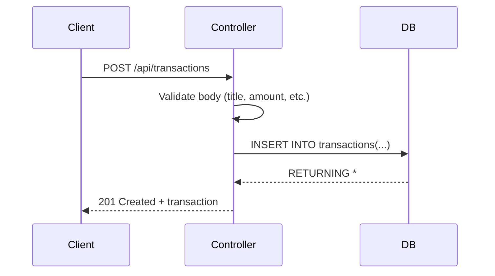
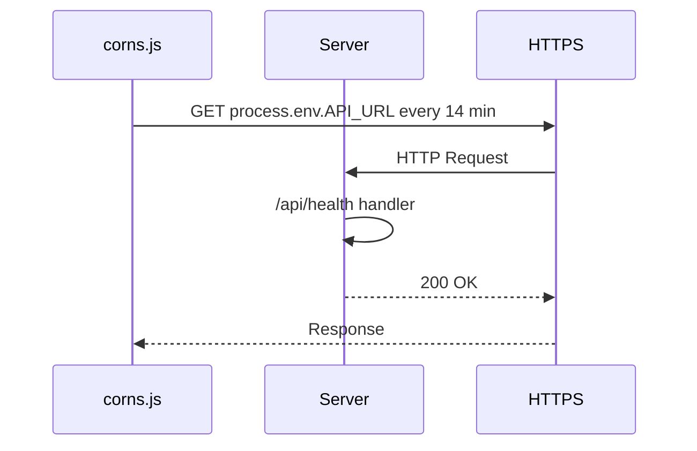
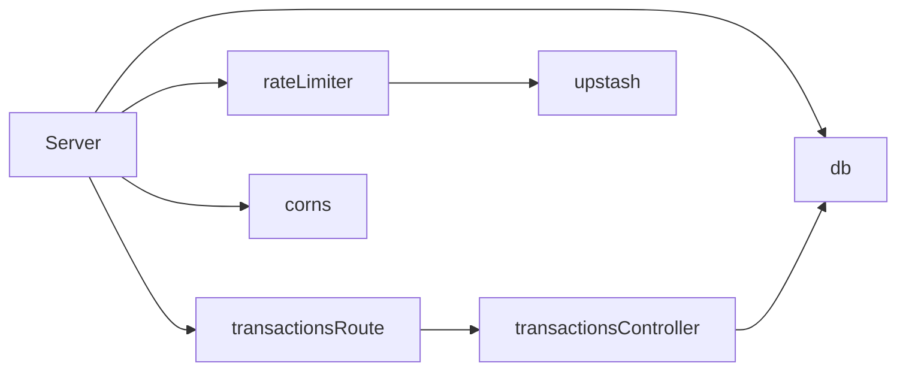

# Backend Architecture

<cite>
**Referenced Files in This Document**   
- [Server.js](file://backend/src/Server.js)
- [db.js](file://backend/src/config/db.js)
- [upstash.js](file://backend/src/config/upstash.js)
- [rateLimiter.js](file://backend/src/middleware/rateLimiter.js)
- [transactionsRoute.js](file://backend/src/routes/transactionsRoute.js)
- [transactionsController.js](file://backend/src/controllers/transactionsController.js)
- [corns.js](file://backend/src/config/corns.js)
</cite>

## Table of Contents
1. [Introduction](#introduction)
2. [Project Structure](#project-structure)
3. [Core Components](#core-components)
4. [Architecture Overview](#architecture-overview)
5. [Detailed Component Analysis](#detailed-component-analysis)
6. [Dependency Analysis](#dependency-analysis)
7. [Performance Considerations](#performance-considerations)
8. [Troubleshooting Guide](#troubleshooting-guide)
9. [Conclusion](#conclusion)

## Introduction
This document provides a comprehensive overview of the backend server architecture for the *expense-wallet* application. The backend is built using Express.js and follows a layered architectural pattern to ensure separation of concerns, maintainability, and scalability. It connects to a Neon PostgreSQL database and uses Upstash for rate limiting. The server is designed to run on Render, with mechanisms in place to prevent server sleep through periodic health checks. This documentation details the initialization process, middleware pipeline, routing structure, controller logic, database interactions, and production-specific behaviors.

## Project Structure
The backend directory follows a modular and layered structure, separating configuration, business logic, routing, and middleware. This promotes clean code organization and ease of maintenance.



**Diagram sources**
- [Server.js](file://backend/src/Server.js#L1-L38)
- [db.js](file://backend/src/config/db.js#L1-L27)
- [upstash.js](file://backend/src/config/upstash.js#L1-L9)
- [rateLimiter.js](file://backend/src/middleware/rateLimiter.js#L1-L30)
- [transactionsRoute.js](file://backend/src/routes/transactionsRoute.js#L1-L13)
- [transactionsController.js](file://backend/src/controllers/transactionsController.js#L1-L90)
- [corns.js](file://backend/src/config/corns.js#L1-L28)

**Section sources**
- [Server.js](file://backend/src/Server.js#L1-L38)
- [db.js](file://backend/src/config/db.js#L1-L27)

## Core Components
The backend consists of several core components that work together to handle HTTP requests, enforce security, interact with the database, and maintain uptime in production.

- **Server.js**: Entry point that initializes Express, middleware, routes, and starts the server.
- **db.js**: Manages the Neon PostgreSQL connection and ensures the transactions table exists.
- **upstash.js**: Configures the Upstash Redis-based rate limiter with a sliding window policy.
- **rateLimiter.js**: Middleware that applies rate limiting to all incoming requests.
- **transactionsRoute.js**: Defines API endpoints for transaction operations.
- **transactionsController.js**: Contains business logic for handling transaction-related requests.
- **corns.js**: Implements a cron job to ping the health endpoint periodically in production.

These components follow a clear dependency hierarchy and separation of concerns.

**Section sources**
- [Server.js](file://backend/src/Server.js#L1-L38)
- [db.js](file://backend/src/config/db.js#L1-L27)
- [upstash.js](file://backend/src/config/upstash.js#L1-L9)
- [rateLimiter.js](file://backend/src/middleware/rateLimiter.js#L1-L30)
- [transactionsRoute.js](file://backend/src/routes/transactionsRoute.js#L1-L13)
- [transactionsController.js](file://backend/src/controllers/transactionsController.js#L1-L90)
- [corns.js](file://backend/src/config/corns.js#L1-L28)

## Architecture Overview
The backend follows a classic Express.js layered architecture with clear separation between routing, controllers, and data access. All API requests pass through a middleware pipeline before reaching the route handlers.



**Diagram sources**
- [Server.js](file://backend/src/Server.js#L1-L38)
- [rateLimiter.js](file://backend/src/middleware/rateLimiter.js#L1-L30)
- [transactionsRoute.js](file://backend/src/routes/transactionsRoute.js#L1-L13)
- [transactionsController.js](file://backend/src/controllers/transactionsController.js#L1-L90)
- [db.js](file://backend/src/config/db.js#L1-L27)

## Detailed Component Analysis

### Server Initialization and Middleware Pipeline
The server is bootstrapped in `Server.js`, where Express is configured with essential middleware and routes.



**Diagram sources**
- [Server.js](file://backend/src/Server.js#L1-L38)

**Section sources**
- [Server.js](file://backend/src/Server.js#L1-L38)

### Database Initialization and Schema Management
The `db.js` file initializes the database connection using Neon's serverless driver and ensures the `transactions` table exists upon startup.



The table schema includes:
- **id**: SERIAL PRIMARY KEY
- **user_id**: VARCHAR(255), not null
- **title**: VARCHAR(255), not null
- **amount**: DECIMAL(10,2), not null (supports up to 99999999.99)
- **category**: VARCHAR(255), not null
- **created_at**: DATE, defaults to current date

All SQL queries use parameterized statements via template literals, preventing SQL injection attacks.

**Diagram sources**
- [db.js](file://backend/src/config/db.js#L1-L27)

**Section sources**
- [db.js](file://backend/src/config/db.js#L1-L27)

### Rate Limiting with Upstash
The rate limiting system uses Upstash Redis to enforce a sliding window limit of 50 requests per 60 seconds.

```mermaid
classDiagram
class Ratelimit {
+redis : Redis
+limiter : Function
+limit(key) : Promise~{success, limit, remaining, reset}~
}
class Redis {
+fromEnv() : Redis
}
class rateLimiter {
+middleware(req, res, next)
}
Ratelimit --> Redis : "uses"
rateLimiter --> Ratelimit : "depends on"
```

The `rateLimiter.js` middleware intercepts all requests and checks against the fixed key `"my-rate-limit"`. In production, this should be enhanced to use user ID or IP address for per-user limiting.

**Diagram sources**
- [upstash.js](file://backend/src/config/upstash.js#L1-L9)
- [rateLimiter.js](file://backend/src/middleware/rateLimiter.js#L1-L30)

**Section sources**
- [upstash.js](file://backend/src/config/upstash.js#L1-L9)
- [rateLimiter.js](file://backend/src/middleware/rateLimiter.js#L1-L30)

### API Routing and Controller Delegation
The application uses a clean routing pattern where routes delegate to controller functions.

```mermaid
flowchart LR
A[/api/transactions] --> B[GET /:userId]
A --> C[POST /]
A --> D[DELETE /:id]
A --> E[GET /summary/:userId]
B --> F[getTransactionByUserId]
C --> G[createTransactions]
D --> H[deleteTransaction]
E --> I[summaryTransactions]
F --> J[transactionsController.js]
G --> J
H --> J
I --> J
```

Each route is mapped to a specific controller function in `transactionsController.js`.

**Diagram sources**
- [transactionsRoute.js](file://backend/src/routes/transactionsRoute.js#L1-L13)
- [transactionsController.js](file://backend/src/controllers/transactionsController.js#L1-L90)

**Section sources**
- [transactionsRoute.js](file://backend/src/routes/transactionsRoute.js#L1-L13)
- [transactionsController.js](file://backend/src/controllers/transactionsController.js#L1-L90)

### Transaction Controller Logic
The controller handles all business logic for transaction operations, including validation and database interaction.



Key features:
- Input validation for required fields
- Parameterized SQL queries to prevent injection
- Proper HTTP status codes (400, 404, 500, etc.)
- Summary endpoint calculates balance, income, and expense using COALESCE to handle nulls

**Section sources**
- [transactionsController.js](file://backend/src/controllers/transactionsController.js#L1-L90)

### Health Check and Cron Job for Production
To prevent server sleep on Render, a health check endpoint and cron job are implemented.



The `/api/health` endpoint returns a simple status message. The cron job runs only in production (`NODE_ENV=production`) and pings the API every 14 minutes to keep the server awake.

**Diagram sources**
- [Server.js](file://backend/src/Server.js#L1-L38)
- [corns.js](file://backend/src/config/corns.js#L1-L28)

**Section sources**
- [Server.js](file://backend/src/Server.js#L1-L38)
- [corns.js](file://backend/src/config/corns.js#L1-L28)

## Dependency Analysis
The backend components are loosely coupled with clear import dependencies.



There are no circular dependencies. External dependencies include:
- `@neondatabase/serverless`: For PostgreSQL connection
- `@upstash/ratelimit` and `@upstash/redis`: For rate limiting
- `cron`: For scheduled tasks
- `dotenv`: For environment variable loading

**Diagram sources**
- [Server.js](file://backend/src/Server.js#L1-L38)
- [package.json](file://backend/package.json)

**Section sources**
- [Server.js](file://backend/src/Server.js#L1-L38)

## Performance Considerations
- **Rate Limiting**: Prevents abuse and ensures fair usage with minimal overhead.
- **Database Queries**: All queries are parameterized and use indexes implicitly on primary keys.
- **Cron Job**: Lightweight GET request every 14 minutes to maintain uptime.
- **Connection Management**: Neon's serverless driver manages connections efficiently.
- **Error Handling**: Controllers include try-catch blocks to prevent crashes.

Potential improvements:
- Add caching for summary data
- Implement pagination for transaction lists
- Use user-specific rate limiting keys

## Troubleshooting Guide
Common issues and solutions:

- **Server fails to start**: Check `DATABASE_URL` environment variable and network connectivity.
- **500 errors on transactions**: Verify all required fields are sent in the request body.
- **Rate limiting too strict**: Adjust the Upstash configuration in `upstash.js`.
- **Cron job not running**: Ensure `NODE_ENV=production` and `API_URL` is set.
- **Table not created**: Confirm Neon database is accessible and credentials are correct.

Logs are written to stdout for all errors and initialization messages.

**Section sources**
- [db.js](file://backend/src/config/db.js#L1-L27)
- [transactionsController.js](file://backend/src/controllers/transactionsController.js#L1-L90)
- [Server.js](file://backend/src/Server.js#L1-L38)

## Conclusion
The backend architecture of the *expense-wallet* application is well-structured, secure, and production-ready. It follows best practices in Express.js development, including layered architecture, input validation, error handling, and security via rate limiting. The use of Neon PostgreSQL ensures reliable data storage, while Upstash provides robust rate limiting. The health check and cron job mechanism effectively prevents server downtime on Render. This architecture is extensible and can be enhanced with features like authentication, logging, and caching as the application grows.