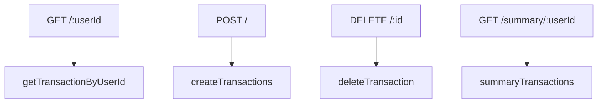

# Database Integration

<cite>
**Referenced Files in This Document**   
- [db.js](file://backend/src/config/db.js#L1-L27)
- [transactionsController.js](file://backend/src/controllers/transactionsController.js#L1-L90)
- [transactionsRoute.js](file://backend/src/routes/transactionsRoute.js#L1-L13)
</cite>

## Table of Contents
1. [Introduction](#introduction)
2. [Project Structure](#project-structure)
3. [Data Model: Transactions Table](#data-model-transactions-table)
4. [Database Connection and Initialization](#database-connection-and-initialization)
5. [Data Access Patterns](#data-access-patterns)
6. [Query Examples and SQL Injection Prevention](#query-examples-and-sql-injection-prevention)
7. [Performance Considerations](#performance-considerations)
8. [Potential Extensions](#potential-extensions)
9. [Data Lifecycle and Backup Strategy](#data-lifecycle-and-backup-strategy)

## Introduction
This document provides comprehensive documentation for the database integration in the **expense-wallet** application, focusing on the `transactions` table. It details the schema design, database connection setup using Neon Serverless, automatic table initialization, data access patterns, security practices, performance considerations, and long-term data management strategies. The goal is to provide both technical and non-technical stakeholders with a clear understanding of how transactional data is stored, accessed, and secured.

## Project Structure
The backend of the **expense-wallet** application follows a modular Node.js structure using Express.js for routing and Neon Serverless for PostgreSQL connectivity. Key components related to database operations are organized under the `backend/src` directory:

- **config/**: Contains configuration files, including `db.js` for database connection and initialization.
- **controllers/**: Houses business logic for handling HTTP requests; `transactionsController.js` manages all transaction-related operations.
- **routes/**: Defines API endpoints; `transactionsRoute.js` maps HTTP verbs to controller functions.
- **Server.js**: Entry point of the application.

This separation of concerns ensures maintainability and scalability.

**Section sources**
- [db.js](file://backend/src/config/db.js#L1-L27)
- [transactionsController.js](file://backend/src/controllers/transactionsController.js#L1-L90)
- [transactionsRoute.js](file://backend/src/routes/transactionsRoute.js#L1-L13)

## Data Model: Transactions Table

The `transactions` table is the core data structure for storing user financial records. Below is the Entity-Relationship (ER) diagram representing its schema.

```mermaid
erDiagram
TRANSACTIONS {
integer id PK
varchar(255) user_id FK
varchar(255) title
decimal(10,2) amount
varchar(255) category
date created_at
}
```

### Schema Details
- **id**: `SERIAL PRIMARY KEY` – Auto-incrementing integer serving as the unique identifier for each transaction.
- **user_id**: `VARCHAR(255) NOT NULL` – Identifier linking the transaction to a specific user. Indexed for fast lookups.
- **title**: `VARCHAR(255) NOT NULL` – Descriptive name of the transaction (e.g., "Grocery Shopping").
- **amount**: `DECIMAL(10,2) NOT NULL` – Monetary value with precision up to two decimal places. Positive values represent income; negative values represent expenses.
- **category**: `VARCHAR(255) NOT NULL` – Classification of the transaction (e.g., "Food", "Salary").
- **created_at**: `DATE NOT NULL DEFAULT CURRENT_DATE` – Date when the transaction was recorded, automatically set to the current date.

### Data Interpretation
- **Positive amount**: Income (e.g., salary, refund)
- **Negative amount**: Expense (e.g., rent, groceries)
- **Zero amount**: Not allowed due to `NOT NULL` constraint

**Diagram sources**
- [db.js](file://backend/src/config/db.js#L6-L14)

**Section sources**
- [db.js](file://backend/src/config/db.js#L6-L14)

## Database Connection and Initialization

The application uses `@neondatabase/serverless` to establish a secure, serverless connection to a PostgreSQL database hosted on Neon. The connection is environment-driven, relying on the `DATABASE_URL` environment variable.

### Connection Setup
```javascript
import {neon} from "@neondatabase/serverless";
export const sql = neon(process.env.DATABASE_URL);
```
- The `neon()` function creates a SQL client that supports tagged template literals for safe query execution.
- Environment variables are loaded via `dotenv`, allowing different configurations for development and production.

### Automatic Table Initialization
The `initDB()` function ensures the `transactions` table exists upon application startup:

```javascript
export async function initDB() {
  try {
    await sql`CREATE TABLE IF NOT EXISTS transactions(...)`; 
    console.log("database initialized successfully");
  } catch (error) {
    console.error("error in initializing the database ", error);
    process.exit(1);
  }
}
```

#### Key Features:
- **Idempotent Creation**: `IF NOT EXISTS` prevents errors if the table already exists.
- **Error Handling**: Logs initialization failures and exits the process to prevent running with an incomplete schema.
- **Automatic Execution**: This function should be called during server startup (not shown in code but implied by design).

**Section sources**
- [db.js](file://backend/src/config/db.js#L1-L27)

## Data Access Patterns

The application implements RESTful APIs to manage transactions, with corresponding controller functions that interact directly with the database.

### Controller Functions Overview
| Function | HTTP Method | Endpoint | Purpose |
|--------|------------|---------|--------|
| `getTransactionByUserId` | GET | `/transactions/:userId` | Retrieve all transactions for a user |
| `createTransactions` | POST | `/transactions` | Add a new transaction |
| `deleteTransaction` | DELETE | `/transactions/:id` | Remove a transaction by ID |
| `summaryTransactions` | GET | `/transactions/summary/:userId` | Get financial summary (balance, income, expense) |

### API Route Mapping


**Diagram sources**
- [transactionsRoute.js](file://backend/src/routes/transactionsRoute.js#L5-L12)

**Section sources**
- [transactionsRoute.js](file://backend/src/routes/transactionsRoute.js#L1-L13)
- [transactionsController.js](file://backend/src/controllers/transactionsController.js#L1-L90)

## Query Examples and SQL Injection Prevention

All database queries use **parameterized queries** via the `sql` template tag, which automatically escapes inputs and prevents SQL injection attacks.

### Example 1: Fetch Transactions by User ID
```javascript
const transactions = await sql`
  SELECT * FROM transactions 
  WHERE user_id = ${userId} 
  ORDER BY created_at DESC
`;
```
- **Security**: The `${userId}` parameter is safely interpolated by the Neon client.
- **Performance**: Results are sorted by creation date in descending order (newest first).

### Example 2: Insert New Transaction
```javascript
const transaction = await sql`
  INSERT INTO transactions(user_id, title, amount, category)
  VALUES (${user_id}, ${title}, ${amount}, ${category})
  RETURNING *
`;
```
- **Validation**: The controller checks for required fields before executing the query.
- **Return Value**: `RETURNING *` returns the full inserted row, including auto-generated `id` and `created_at`.

### Example 3: Delete Transaction by ID
```javascript
if (isNaN(parseInt(id))) {
  return res.status(400).json({message:"invalid transaction id"});
}
const result = await sql`
  DELETE FROM transactions WHERE id = ${id} RETURNING *
`;
```
- **Input Validation**: Ensures the `id` is a valid number.
- **Existence Check**: If `result.length === 0`, the transaction was not found.

### Example 4: Financial Summary
```javascript
const balanceResult = await sql`
  SELECT COALESCE(SUM(amount), 0) as balance 
  FROM transactions WHERE user_id = ${userId}
`;

const incomeResult = await sql`
  SELECT COALESCE(SUM(amount), 0) as income 
  FROM transactions WHERE user_id = ${userId} AND amount > 0
`;

const expenseResult = await sql`
  SELECT COALESCE(SUM(amount), 0) as expense 
  FROM transactions WHERE user_id = ${userId} AND amount < 0
`;
```
- **COALESCE**: Returns `0` if no rows match, avoiding `NULL` values.
- **Efficiency**: Three separate queries are used for clarity and correctness.

**Section sources**
- [transactionsController.js](file://backend/src/controllers/transactionsController.js#L1-L90)

## Performance Considerations

### Indexing Strategy
- **Index on `user_id`**: Although not explicitly defined in the DDL, indexing `user_id` is critical for performance since all read operations are filtered by this field.
- **Recommendation**: Add an index using:
  ```sql
  CREATE INDEX IF NOT EXISTS idx_transactions_user_id ON transactions(user_id);
  ```

### Scalability for Large Datasets
- **Pagination**: Currently, all transactions for a user are fetched at once. For large datasets, implement pagination using `LIMIT` and `OFFSET` or cursor-based pagination.
- **Caching**: Use Redis (already a dependency via Upstash) to cache frequent queries like financial summaries.
- **Query Optimization**: Consider partial indexes for common filters (e.g., `amount > 0` for income).

### Read/Write Patterns
- **Read-heavy**: Users frequently view their transaction history and summaries.
- **Write frequency**: Moderate; each transaction creates one write.
- **Optimization**: Batch inserts could be considered for bulk imports (not currently supported).

**Section sources**
- [transactionsController.js](file://backend/src/controllers/transactionsController.js#L1-L90)
- [db.js](file://backend/src/config/db.js#L6-L14)

## Potential Extensions

### Schema Enhancements
| Field | Type | Purpose |
|------|------|--------|
| `type` | `ENUM('income', 'expense')` | Explicitly classify transaction type |
| `currency` | `VARCHAR(3)` | Support multi-currency transactions |
| `updated_at` | `TIMESTAMP` | Track modifications |
| `metadata` | `JSONB` | Store additional details (e.g., receipt image URL) |

### Index Additions
```sql
-- For filtering by category
CREATE INDEX idx_transactions_category ON transactions(category);

-- For time-based queries
CREATE INDEX idx_transactions_created_at ON transactions(created_at);
```

### API Extensions
- **PUT /:id**: Update existing transaction
- **GET /filter**: Filter by date range, category, or amount
- **Bulk Import Endpoint**: Accept CSV or JSON array of transactions

### Analytics Features
- Monthly spending trends
- Category-wise expense breakdown
- Budget tracking alerts

**Section sources**
- [db.js](file://backend/src/config/db.js#L6-L14)
- [transactionsController.js](file://backend/src/controllers/transactionsController.js#L1-L90)

## Data Lifecycle and Backup Strategy

### Data Retention
- **Current Policy**: No explicit retention policy; data is stored indefinitely.
- **Recommendation**: Allow users to soft-delete transactions (add `deleted_at` column) or implement retention rules (e.g., auto-delete after 7 years).

### Backup Strategy
- **Neon Serverless**: Automatically provides point-in-time recovery (PITR) and continuous backups.
- **Manual Exports**: Implement scheduled exports to cloud storage (e.g., AWS S3) using cron jobs (`cron` is already a dependency).
- **Disaster Recovery**: Regularly test restore procedures from backups.

### Security and Compliance
- **Encryption**: Neon encrypts data at rest and in transit.
- **GDPR/CCPA**: Support data export and deletion requests via API extensions.
- **Audit Logs**: Not currently implemented; consider logging critical operations.

**Section sources**
- [db.js](file://backend/src/config/db.js#L1-L27)
- [transactionsController.js](file://backend/src/controllers/transactionsController.js#L1-L90)