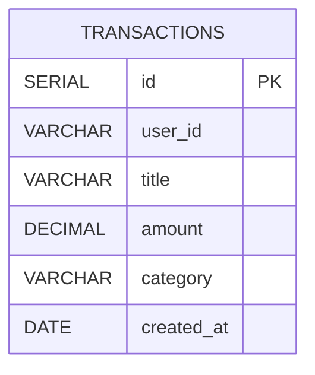
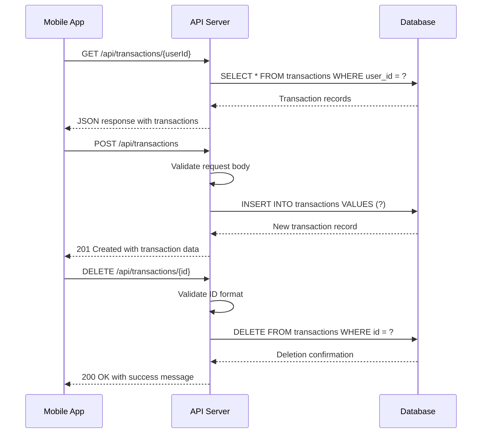

# Data Model

<cite>
**Referenced Files in This Document**   
- [db.js](file://backend/src/config/db.js#L0-L27)
- [transactionsController.js](file://backend/src/controllers/transactionsController.js#L0-L90)
- [transactionsRoute.js](file://backend/src/routes/transactionsRoute.js#L0-L13)
- [create.jsx](file://mobile/app/(root)/create.jsx#L0-L178)
- [useTransactions.js](file://mobile/hooks/useTransactions.js#L31-L69)
</cite>

## Table of Contents
1. [Data Model](#data-model)
2. [Schema Definition](#schema-definition)
3. [Database Initialization](#database-initialization)
4. [Data Access Patterns](#data-access-patterns)
5. [Financial Summary Calculations](#financial-summary-calculations)
6. [Data Lifecycle and Integrity](#data-lifecycle-and-integrity)
7. [Performance Considerations](#performance-considerations)

## Schema Definition

The `transactions` table in the expense-wallet application is designed to store financial transaction records with the following schema:

- **id**: `SERIAL PRIMARY KEY` - Auto-incrementing unique identifier for each transaction
- **user_id**: `VARCHAR(255) NOT NULL` - Identifier linking the transaction to a specific user
- **title**: `VARCHAR(255) NOT NULL` - Descriptive title of the transaction (e.g., "Grocery Shopping", "Salary Deposit")
- **amount**: `DECIMAL(10,2) NOT NULL` - Monetary value of the transaction. Positive values represent income, negative values represent expenses
- **category**: `VARCHAR(255) NOT NULL` - Classification of the transaction (e.g., "Food & Drinks", "Income", "Transportation")
- **created_at**: `DATE NOT NULL DEFAULT CURRENT_DATE` - Date when the transaction was recorded, automatically set to the current date

The `amount` field uses a decimal format with precision of 10 digits total and 2 digits after the decimal point, allowing values from -99999999.99 to 99999999.99. This design choice ensures accurate financial calculations without floating-point precision errors.

**Section sources**
- [db.js](file://backend/src/config/db.js#L10-L18)

## Database Initialization

The database schema is initialized through the `initDB()` function in `db.js`, which executes a SQL command to create the `transactions` table if it does not already exist. This function runs when the application starts, ensuring the database structure is in place before any operations occur.

The initialization process includes:
- Creating the table with all required columns and constraints
- Setting `id` as the primary key with auto-increment functionality
- Enforcing NOT NULL constraints on all fields to ensure data completeness
- Setting a default value of the current date for the `created_at` field

This approach provides schema consistency across deployments and prevents runtime errors due to missing tables.



**Diagram sources**
- [db.js](file://backend/src/config/db.js#L10-L18)

**Section sources**
- [db.js](file://backend/src/config/db.js#L5-L27)
- [Server.js](file://backend/src/Server.js#L29-L37)

## Data Access Patterns

The application implements three primary data access operations for the transactions table: retrieval, creation, and deletion.

### Transaction Retrieval
The `getTransactionByUserId` function retrieves all transactions for a specific user, ordered by creation date in descending order (newest first). This SELECT query filters records by `user_id` and returns the complete transaction data.

```sql
SELECT * FROM transactions WHERE user_id = ${userId} ORDER BY created_at DESC
```

### Transaction Creation
The `createTransactions` function inserts new transaction records into the database. It validates that all required fields are present before executing the INSERT statement. The operation returns the newly created transaction record.

```sql
INSERT INTO transactions(user_id, title, amount, category)
VALUES (${user_id}, ${title}, ${amount}, ${category})
RETURNING *
```

### Transaction Deletion
The `deleteTransaction` function removes a transaction by its ID. It first validates that the ID is numeric, then executes a DELETE operation with a RETURNING clause to confirm the deletion. The function checks if any rows were affected to provide appropriate feedback.

```sql
DELETE FROM transactions WHERE id = ${id} RETURNING *
```

These operations are exposed through REST API endpoints defined in `transactionsRoute.js`, following standard HTTP methods (GET, POST, DELETE).



**Diagram sources**
- [transactionsController.js](file://backend/src/controllers/transactionsController.js#L1-L90)
- [transactionsRoute.js](file://backend/src/routes/transactionsRoute.js#L5-L13)

**Section sources**
- [transactionsController.js](file://backend/src/controllers/transactionsController.js#L1-L90)
- [transactionsRoute.js](file://backend/src/routes/transactionsRoute.js#L1-L13)

## Financial Summary Calculations

The application calculates financial summaries through the `summaryTransactions` function, which provides three key metrics: balance, total income, and total expenses for a user.

### Balance Calculation
The overall balance is calculated as the sum of all transaction amounts, treating income as positive values and expenses as negative values.

```sql
SELECT COALESCE(SUM(amount), 0) as balance FROM transactions WHERE user_id = ${userId}
```

### Income Calculation
Total income is derived by summing only positive amounts, representing all incoming funds.

```sql
SELECT COALESCE(SUM(amount), 0) as income FROM transactions WHERE user_id = ${userId} AND amount > 0
```

### Expense Calculation
Total expenses are calculated by summing only negative amounts, representing all outgoing funds.

```sql
SELECT COALESCE(SUM(amount), 0) as expense FROM transactions WHERE user_id = ${userId} AND amount < 0
```

The `COALESCE` function ensures that if no transactions exist, the result defaults to 0 rather than NULL, preventing potential errors in the frontend display. These aggregate queries are efficient and leverage database-level computation rather than processing data in application memory.

The mobile application's `useTransactions.js` hook calls this summary endpoint and combines the data with transaction records to provide a comprehensive financial overview.

**Section sources**
- [transactionsController.js](file://backend/src/controllers/transactionsController.js#L65-L90)
- [useTransactions.js](file://mobile/hooks/useTransactions.js#L31-L40)

## Data Lifecycle and Integrity

Transaction records follow a permanent storage model with selective deletion. Once created, records persist indefinitely unless explicitly deleted by the user. This approach ensures an accurate historical record of all financial activities.

### Data Integrity Rules
- All fields are required (NOT NULL constraints)
- The `user_id` field establishes ownership and enables multi-user support
- The `amount` field uses DECIMAL type for precise financial calculations
- The `created_at` field automatically captures the transaction date

### Absence of UPDATE Operations
Notably, the current implementation does not include UPDATE operations for transactions. Users cannot modify existing transactions; instead, they must delete and recreate them if changes are needed. This design decision:
- Simplifies the data model and reduces complexity
- Prevents potential data consistency issues
- Maintains an immutable record of financial history
- Aligns with common expense tracking applications that prioritize simplicity

The mobile application enforces this workflow by only providing "Add" and "Delete" options in the UI, with no edit functionality.

**Section sources**
- [transactionsController.js](file://backend/src/controllers/transactionsController.js#L1-L90)
- [create.jsx](file://mobile/app/(root)/create.jsx#L30-L67)
- [TransactionItem.jsx](file://mobile/components/TransactionItem.jsx#L32-L45)

## Performance Considerations

### Query Optimization
The primary query pattern involves filtering transactions by `user_id`, which is a critical performance consideration. Currently, no explicit index is defined on the `user_id` column, which could lead to full table scans as the dataset grows.

### Recommended Indexing Strategy
To optimize query performance, particularly for the `getTransactionByUserId` and summary queries, an index on the `user_id` column should be implemented:

```sql
CREATE INDEX idx_transactions_user_id ON transactions(user_id);
```

Additional potential indexes include:
- Composite index on `(user_id, created_at)` to optimize date-ordered queries
- Index on `category` for potential future filtering by transaction type

### Data Volume Considerations
As the application scales:
- The current design may require pagination for the `getTransactionByUserId` endpoint to prevent large result sets
- Regular database maintenance and vacuuming may be necessary for the PostgreSQL-based Neon database
- Monitoring query performance through database analytics would help identify bottlenecks

The use of parameterized queries with the `sql` template tag prevents SQL injection attacks and ensures query plan caching, contributing to overall performance and security.

**Section sources**
- [db.js](file://backend/src/config/db.js#L10-L18)
- [transactionsController.js](file://backend/src/controllers/transactionsController.js#L1-L90)