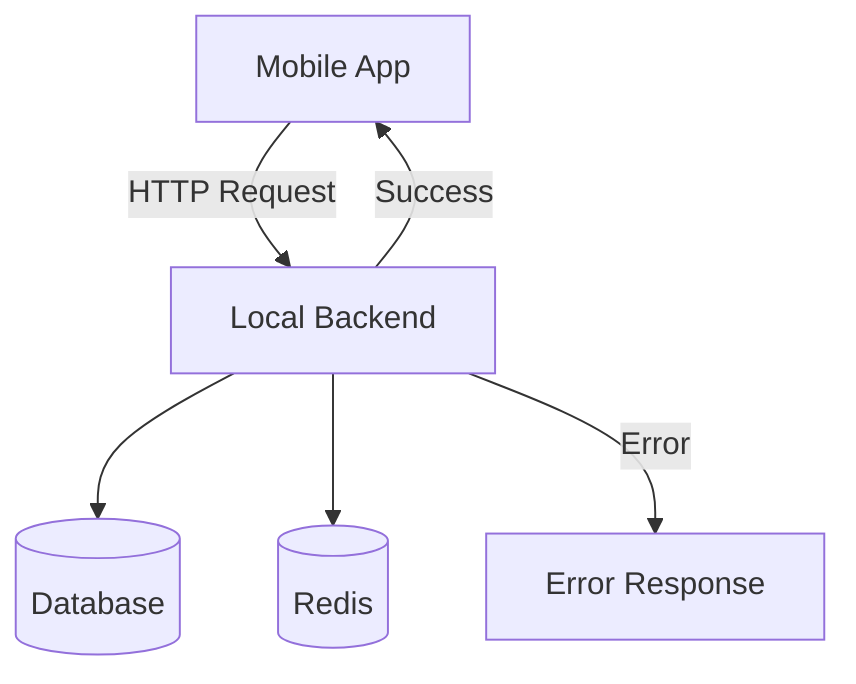
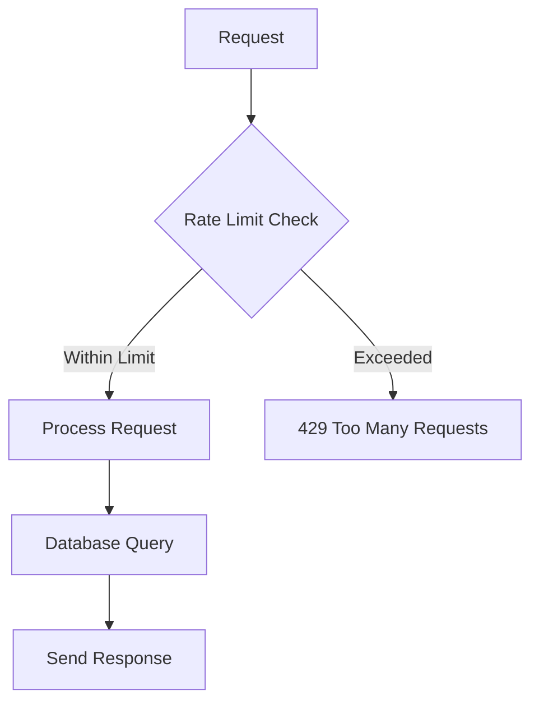

# Developer Onboarding Guide

<cite>
**Referenced Files in This Document**   
- [backend/package.json](file://backend/package.json)
- [backend/src/Server.js](file://backend/src/Server.js)
- [backend/src/config/corns.js](file://backend/src/config/corns.js)
- [backend/src/config/db.js](file://backend/src/config/db.js)
- [backend/src/config/upstash.js](file://backend/src/config/upstash.js)
- [backend/src/middleware/rateLimiter.js](file://backend/src/middleware/rateLimiter.js)
- [mobile/constants/api.js](file://mobile/constants/api.js)
- [mobile/package.json](file://mobile/package.json)
- [README.md](file://README.md)
</cite>

## Table of Contents
1. [Introduction](#introduction)
2. [Prerequisites](#prerequisites)
3. [Cloning the Repository](#cloning-the-repository)
4. [Backend Setup](#backend-setup)
5. [Mobile App Setup](#mobile-app-setup)
6. [Environment Configuration](#environment-configuration)
7. [Connecting Mobile App to Local Backend](#connecting-mobile-app-to-local-backend)
8. [Running the Application](#running-the-application)
9. [Troubleshooting Common Issues](#troubleshooting-common-issues)
10. [Conclusion](#conclusion)

## Introduction

This guide provides a comprehensive step-by-step walkthrough for setting up the **expense-wallet** full-stack application locally. The project consists of a Node.js/Express backend and a React Native mobile frontend built with Expo. This document will help developers go from zero to running the complete stack in under 15 minutes, covering cloning, dependency installation, environment setup, and troubleshooting.

**Section sources**
- [README.md](file://README.md#L0-L221)

## Prerequisites

Before beginning setup, ensure your development environment includes the following:

- **Node.js** (v18 or higher)
- **npm** (bundled with Node.js)
- **Expo CLI** (install globally via `npm install -g @expo/cli`)
- **Git** (for cloning the repository)

These tools are essential for running both the backend server and the mobile application development server.

**Section sources**
- [README.md](file://README.md#L58-L61)

## Cloning the Repository

Begin by cloning the project repository from GitHub:

```bash
git clone https://github.com/yourusername/expense-wallet.git
cd expense-wallet
```

This creates a local copy of the entire project, including both the `backend` and `mobile` directories.

**Section sources**
- [README.md](file://README.md#L63-L66)

## Backend Setup

Navigate to the backend directory and install dependencies:

```bash
cd backend
npm install
```

The backend uses the following key dependencies:
- **Express.js**: Web server framework
- **Neon Database**: Serverless PostgreSQL
- **Upstash Redis**: Rate limiting
- **Cron**: Scheduled health checks
- **Dotenv**: Environment variable management

Start the development server using nodemon for auto-reload:

```bash
npm run dev
```

This runs the script defined in `package.json` and starts the Express server on port 5001 (or the port specified in `PORT` environment variable).

**Section sources**
- [backend/package.json](file://backend/package.json#L0-L25)
- [backend/src/Server.js](file://backend/src/Server.js#L0-L37)

## Mobile App Setup

Open a new terminal, navigate to the mobile directory, and install dependencies:

```bash
cd mobile
npm install
```

Start the Expo development server:

```bash
npm start
```

This launches the Expo Dev Server, allowing you to run the app on Android, iOS, or web.

**Section sources**
- [mobile/package.json](file://mobile/package.json)
- [README.md](file://README.md#L88-L91)

## Environment Configuration

### Backend Environment Variables

Create a `.env` file in the `backend` directory by copying the example:

```bash
cp .env.example .env
```

Populate it with the following required variables:

```env
DATABASE_URL=your_neon_database_url
UPSTASH_REDIS_REST_URL=your_upstash_redis_url
UPSTASH_REDIS_REST_TOKEN=your_upstash_redis_token
CLERK_SECRET_KEY=your_clerk_secret_key
```

These are used for:
- **DATABASE_URL**: Connection to Neon PostgreSQL database
- **UPSTASH_REDIS_REST_URL & UPSTASH_REDIS_REST_TOKEN**: Upstash Redis for rate limiting
- **CLERK_SECRET_KEY**: Authentication via Clerk

**Section sources**
- [README.md](file://README.md#L75-L80)

### API URL Configuration for Mobile

The mobile app connects to the backend via the `API_URL` defined in `mobile/constants/api.js`. For local development, update this file to point to your local backend:

```javascript
import { Platform } from 'react-native';

export const API_URL = Platform.OS === 'web' 
  ? "http://localhost:5001/api"
  : "http://YOUR_MACHINE_IP:5001/api";
```

Replace `YOUR_MACHINE_IP` with your computer's local IP address (e.g., `192.168.x.x` or `10.x.x.x`). This is critical for iOS simulators and physical Android devices.

**Note**: 
- Use `localhost` only for web and Android emulators
- Use machine IP for iOS simulators and physical devices

**Section sources**
- [mobile/constants/api.js](file://mobile/constants/api.js#L0-L11)

## Connecting Mobile App to Local Backend

To ensure the mobile app can communicate with the local backend:

1. **Ensure both backend and mobile are on the same network**
2. **Use correct API_URL**:
   - Android Emulator: `http://localhost:5001/api`
   - iOS Simulator: `http://[your-machine-ip]:5001/api`
   - Physical Device: `http://[your-machine-ip]:5001/api`

3. **Verify backend is running** on port 5001
4. **Check firewall settings** to allow incoming connections on port 5001

The backend includes a health check endpoint at `/api/health` that returns `{"status": "ok"}` when operational.



**Diagram sources**
- [backend/src/Server.js](file://backend/src/Server.js#L22-L25)
- [mobile/constants/api.js](file://mobile/constants/api.js#L0-L11)

## Running the Application

### Start Backend
```bash
cd backend
npm run dev
```

### Start Mobile App
```bash
cd mobile
npm start
```

### Launch on Platform
- Press `a` to run on Android
- Press `i` to run on iOS
- Press `w` to run on web

The app will connect to the backend, authenticate via Clerk, and display transaction data.

**Section sources**
- [README.md](file://README.md#L93-L98)

## Troubleshooting Common Issues

### 1. **CORS Errors**
Ensure the backend allows requests from the mobile app's origin. The `cors` middleware is included but may need configuration for specific origins.

### 2. **Network Request Failed**
- Verify backend is running (`npm run dev`)
- Check API_URL uses correct IP and port
- Ensure device and computer are on same network
- Disable firewall temporarily for testing

### 3. **Authentication Not Working**
- Confirm `CLERK_SECRET_KEY` is correctly set
- Ensure Clerk dashboard allows localhost development
- Check Clerk SDK is properly initialized in mobile app

### 4. **Database Connection Issues**
- Validate `DATABASE_URL` format
- Ensure Neon database is active
- Check internet connection

### 5. **Rate Limiting Blocking Requests**
The backend uses Upstash Redis to limit requests. Default: 50 requests per minute.
- Check `UPSTASH_REDIS_REST_URL` and `UPSTASH_REDIS_REST_TOKEN`
- Review `src/middleware/rateLimiter.js`



**Diagram sources**
- [backend/src/middleware/rateLimiter.js](file://backend/src/middleware/rateLimiter.js#L0-L30)
- [backend/src/config/upstash.js](file://backend/src/config/upstash.js#L0-L9)

### 6. **Cron Job Not Running**
The cron job in `corns.js` sends a health check every 14 minutes to prevent backend sleep on platforms like Render.

```javascript
if (process.env.NODE_ENV === "production") job.start();
```

For local testing, temporarily modify this line to always start the job:

```javascript
job.start(); // For local testing
```

**Section sources**
- [backend/src/Server.js](file://backend/src/Server.js#L15)
- [backend/src/config/corns.js](file://backend/src/config/corns.js#L0-L28)

## Conclusion

You now have a fully functional local development environment for the expense-wallet application. The backend runs on Express.js with PostgreSQL and Redis, while the mobile app uses React Native and Expo. With proper environment configuration and network setup, the app should connect seamlessly to the local API. This setup enables rapid development and testing of new features.