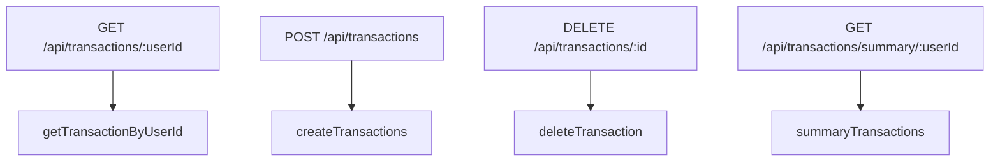
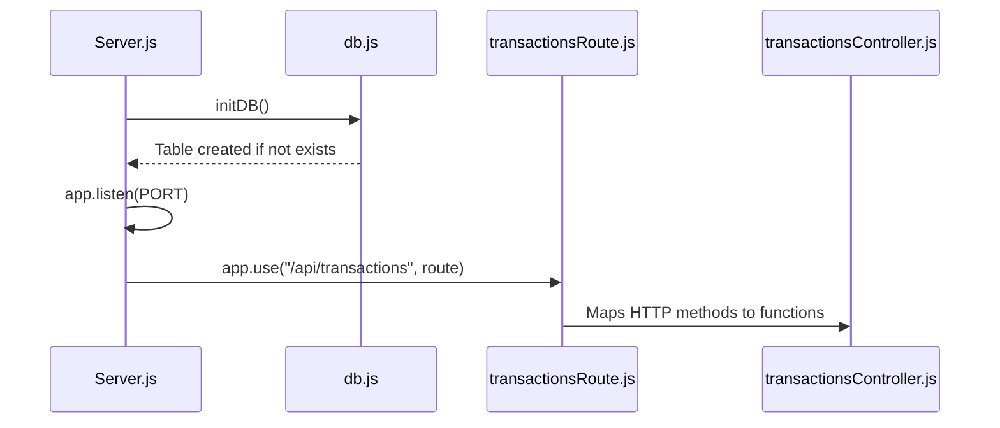

# Directory Structure Breakdown

<cite>
**Referenced Files in This Document**   
- [backend/src/Server.js](file://backend/src/Server.js)
- [backend/src/config/db.js](file://backend/src/config/db.js)
- [backend/src/config/corns.js](file://backend/src/config/corns.js)
- [backend/src/middleware/rateLimiter.js](file://backend/src/middleware/rateLimiter.js)
- [backend/src/routes/transactionsRoute.js](file://backend/src/routes/transactionsRoute.js)
- [backend/src/controllers/transactionsController.js](file://backend/src/controllers/transactionsController.js)
- [mobile/app/_layout.jsx](file://mobile/app/_layout.jsx)
- [mobile/app/(auth)/_layout.jsx](file://mobile/app/(auth)/_layout.jsx)
- [mobile/app/(auth)/sign-in.jsx](file://mobile/app/(auth)/sign-in.jsx)
- [mobile/app/(auth)/sign-up.jsx](file://mobile/app/(auth)/sign-up.jsx)
- [mobile/app/(root)/_layout.jsx](file://mobile/app/(root)/_layout.jsx)
- [mobile/app/(root)/index.jsx](file://mobile/app/(root)/index.jsx)
- [mobile/app/(root)/create.jsx](file://mobile/app/(root)/create.jsx)
- [mobile/components/BalanceCard.jsx](file://mobile/components/BalanceCard.jsx)
- [mobile/components/TransactionItem.jsx](file://mobile/components/TransactionItem.jsx)
- [mobile/components/SafeScreen.jsx](file://mobile/components/SafeScreen.jsx)
- [mobile/components/SignOutButton.jsx](file://mobile/components/SignOutButton.jsx)
- [mobile/components/NoTransactionsFound.jsx](file://mobile/components/NoTransactionsFound.jsx)
- [mobile/components/PageLoader.jsx](file://mobile/components/PageLoader.jsx)
- [mobile/hooks/useTransactions.js](file://mobile/hooks/useTransactions.js)
- [mobile/constants/api.js](file://mobile/constants/api.js)
- [mobile/constants/colors.js](file://mobile/constants/colors.js)
- [mobile/assets/styles/auth.styles.js](file://mobile/assets/styles/auth.styles.js)
- [mobile/assets/styles/home.styles.js](file://mobile/assets/styles/home.styles.js)
- [mobile/assets/styles/create.styles.js](file://mobile/assets/styles/create.styles.js)
- [mobile/lib/utils.js](file://mobile/lib/utils.js)
</cite>

## Table of Contents
1. [Directory Structure Breakdown](#directory-structure-breakdown)
2. [Backend Structure](#backend-structure)
3. [Mobile Application Structure](#mobile-application-structure)
4. [Special Directories and Files](#special-directories-and-files)
5. [Development Guidance](#development-guidance)

## Backend Structure

The backend of the **Expense Wallet** application is built using **Express.js**, a minimal and flexible Node.js web application framework. It is located in the `/backend` directory and follows a modular architecture that separates concerns into distinct folders: configuration, controllers, middleware, routes, and the main server entry point.

### Configuration: `/backend/src/config`
This directory contains essential setup files for the backend:
- **db.js**: Initializes the database connection using Neon Serverless PostgreSQL via the `@neondatabase/serverless` driver. It exports a `sql` instance and an `initDB()` function that ensures the `transactions` table exists upon startup.
- **corns.js**: Likely contains scheduled jobs (e.g., cron-like tasks) to keep the backend alive on platforms like Render. It starts only in production mode.
- **upstash.js**: Possibly used for Redis-based rate limiting or caching (not analyzed in detail).

**Section sources**
- [backend/src/config/db.js](file://backend/src/config/db.js#L1-L27)
- [backend/src/config/corns.js](file://backend/src/config/corns.js#L1-L10)

### Controllers: `/backend/src/controllers`
Contains business logic for handling HTTP requests. Each controller function interacts with the database and returns appropriate responses.
- **transactionsController.js**: Implements CRUD operations for transactions:
  - `getTransactionByUserId`: Fetches all transactions for a user.
  - `createTransactions`: Inserts a new transaction.
  - `deleteTransaction`: Deletes a transaction by ID.
  - `summaryTransactions`: Computes balance, income, and expense summaries.

**Section sources**
- [backend/src/controllers/transactionsController.js](file://backend/src/controllers/transactionsController.js#L1-L90)

### Routes: `/backend/src/routes`
Defines API endpoints and maps them to controller functions.
- **transactionsRoute.js**: Sets up RESTful routes under `/api/transactions`:
  - `GET /:userId` → `getTransactionByUserId`
  - `POST /` → `createTransactions`
  - `DELETE /:id` → `deleteTransaction`
  - `GET /summary/:userId` → `summaryTransactions`



**Diagram sources**
- [backend/src/routes/transactionsRoute.js](file://backend/src/routes/transactionsRoute.js#L1-L13)
- [backend/src/controllers/transactionsController.js](file://backend/src/controllers/transactionsController.js#L1-L90)

### Middleware: `/backend/src/middleware`
- **rateLimiter.js**: Applies rate limiting to prevent abuse of API endpoints (file not read, but referenced in Server.js).

### Entry Point: `/backend/src/Server.js`
The main application file that:
- Loads environment variables via `dotenv`.
- Initializes Express app.
- Applies middleware (`rateLimiter`, JSON parsing).
- Mounts transaction routes.
- Starts the server on port 5001 (or as defined in `PORT`).
- Calls `initDB()` to ensure database readiness before listening.



**Diagram sources**
- [backend/src/Server.js](file://backend/src/Server.js#L1-L38)
- [backend/src/config/db.js](file://backend/src/config/db.js#L1-L27)

## Mobile Application Structure

The mobile frontend is built using **Expo** with **React Native** and the **Expo Router** (file-based routing). It resides in the `/mobile` directory and uses a modern component-based architecture.

### App Router: `/mobile/app`
This directory uses Expo’s file-based routing system with route groups:
- **(auth)**: Contains authentication screens.
  - `_layout.jsx`: Shared layout for auth screens.
  - `sign-in.jsx`: Login screen.
  - `sign-up.jsx`: Registration screen.
- **(root)**: Main app screens after authentication.
  - `_layout.jsx`: Layout wrapper for authenticated routes.
  - `index.jsx`: Home screen (likely transaction list).
  - `create.jsx`: Screen for adding new transactions.
- **_layout.jsx**: Root layout for the entire app, wrapping all routes with `ClerkProvider` for authentication and `SafeScreen` for safe area handling.

```mermaid
graph TB
A[App Root Layout] --> B[(auth)]
A --> C[(root)]
B --> D[Sign In]
B --> E[Sign Up]
C --> F[Home (index)]
C --> G[Create Transaction]
```

**Diagram sources**
- [mobile/app/_layout.jsx](file://mobile/app/_layout.jsx#L1-L16)
- [mobile/app/(auth)/_layout.jsx](file://mobile/app/(auth)/_layout.jsx#L1-L10)
- [mobile/app/(root)/_layout.jsx](file://mobile/app/(root)/_layout.jsx#L1-L10)

### Components: `/mobile/components`
Reusable UI components:
- **BalanceCard.jsx**: Displays user's financial summary.
- **TransactionItem.jsx**: Renders a single transaction entry.
- **SafeScreen.jsx**: Ensures content respects device safe areas.
- **SignOutButton.jsx**: Provides logout functionality.
- **NoTransactionsFound.jsx**: Empty state when no transactions exist.
- **PageLoader.jsx**: Loading indicator.

**Section sources**
- [mobile/components/BalanceCard.jsx](file://mobile/components/BalanceCard.jsx#L1-L50)
- [mobile/components/TransactionItem.jsx](file://mobile/components/TransactionItem.jsx#L1-L40)
- [mobile/components/SafeScreen.jsx](file://mobile/components/SafeScreen.jsx#L1-L20)

### Hooks: `/mobile/hooks`
Custom React hooks for encapsulating logic:
- **useTransactions.js**: Likely manages fetching, creating, and deleting transactions via API calls.

**Section sources**
- [mobile/hooks/useTransactions.js](file://mobile/hooks/useTransactions.js#L1-L30)

### Constants: `/mobile/constants`
Shared configuration values:
- **api.js**: Contains `API_URL` for connecting to the backend.
- **colors.js**: Defines color palette for consistent theming.

**Section sources**
- [mobile/constants/api.js](file://mobile/constants/api.js#L1-L5)
- [mobile/constants/colors.js](file://mobile/constants/colors.js#L1-L10)

### Styles: `/mobile/assets/styles`
Styling modules for individual screens:
- **auth.styles.js**: Styles for sign-in and sign-up screens.
- **home.styles.js**: Styles for the home screen.
- **create.styles.js**: Styles for the create transaction screen.

**Section sources**
- [mobile/assets/styles/auth.styles.js](file://mobile/assets/styles/auth.styles.js#L1-L25)
- [mobile/assets/styles/home.styles.js](file://mobile/assets/styles/home.styles.js#L1-L30)

### Utilities: `/mobile/lib`
- **utils.js**: General utility functions (e.g., formatters, validators).

**Section sources**
- [mobile/lib/utils.js](file://mobile/lib/utils.js#L1-L20)

## Special Directories and Files

### `.expo`
Auto-generated directory by Expo CLI:
- Contains configuration like `devices.json` and TypeScript types for routing (`router.d.ts`).
- Should not be manually edited.

### `assets\styles`
Holds modular style objects used across components. Uses JavaScript modules instead of CSS-in-JS libraries.

### `package.json` Files
- `/backend/package.json`: Lists Express, Neon, and other backend dependencies.
- `/mobile/package.json`: Includes Expo, React Native, Clerk, and UI dependencies.

## Development Guidance

### Adding New API Endpoints
To add a new API feature:
1. Create a new controller function in `/backend/src/controllers`.
2. Define the route in a new or existing file under `/backend/src/routes`.
3. Import and mount the route in `Server.js`.

### Adding New Screens
To add a new screen in the mobile app:
1. Create a new `.jsx` file under `/mobile/app/(root)` for main features or `/mobile/app/(auth)` for auth flows.
2. Use `useTransactions.js` or create a new hook in `/mobile/hooks` for data logic.
3. Style with a new file in `/mobile/assets/styles` if needed.

### Environment Configuration
Ensure `.env` files are set with:
- `DATABASE_URL`: For Neon PostgreSQL.
- `PORT`: Backend server port.
- `CLERK_PUBLISHABLE_KEY`, `CLERK_SECRET_KEY`: For authentication.

**Section sources**
- [backend/src/Server.js](file://backend/src/Server.js#L1-L38)
- [mobile/constants/api.js](file://mobile/constants/api.js#L1-L5)