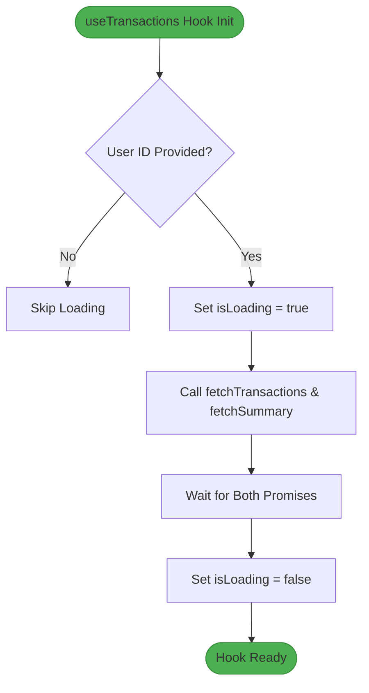
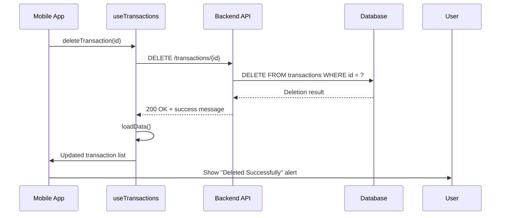
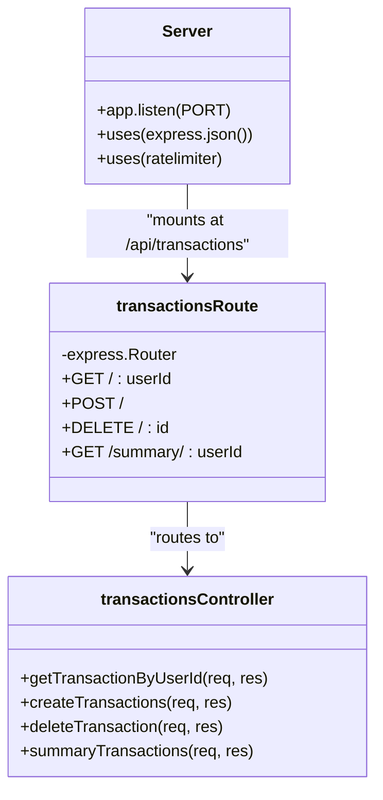

# API Clients

<cite>
**Referenced Files in This Document**   
- [api.js](file://mobile/constants/api.js#L1-L11)
- [useTransactions.js](file://mobile/hooks/useTransactions.js#L1-L70)
- [transactionsRoute.js](file://backend/src/routes/transactionsRoute.js#L1-L13)
- [transactionsController.js](file://backend/src/controllers/transactionsController.js#L1-L90)
- [Server.js](file://backend/src/Server.js#L1-L37)
</cite>

## Table of Contents
1. [Introduction](#introduction)
2. [API URL Configuration](#api-url-configuration)
3. [Transaction Data Handling with useTransactions Hook](#transaction-data-handling-with-usetransactions-hook)
4. [HTTP Request Implementation](#http-request-implementation)
5. [Backend Endpoint Routing and Controller Logic](#backend-endpoint-routing-and-controller-logic)
6. [Error Handling and User Feedback](#error-handling-and-user-feedback)
7. [Extending the API Client](#extending-the-api-client)
8. [Troubleshooting Common Issues](#troubleshooting-common-issues)

## Introduction
This document provides a comprehensive overview of the API client implementation in the **expense-wallet** mobile frontend. It details how the application dynamically configures its backend API endpoint based on the execution environment (web, Android, iOS simulator), ensuring seamless development and testing across platforms. The integration between the frontend and backend is achieved through RESTful endpoints for managing financial transactions, with robust error handling and user feedback mechanisms. This guide enables developers to understand, configure, debug, and extend the API communication layer effectively.

## API URL Configuration

The `API_URL` constant, defined in `api.js`, enables environment-aware backend connectivity by leveraging React Native's `Platform` module to determine the appropriate base URL for API requests.

```javascript
import { Platform } from 'react-native';

export const API_URL = Platform.OS === 'web' 
  ? "http://localhost:5001/api"           // For web browser
  : "http://10.62.106.16:5001/api";       // For physical mobile testing
```

### Dynamic Environment Resolution
- **Web (Browser)**: Uses `http://localhost:5001/api` — connects directly to the local development server.
- **Mobile (Android/iOS)**: Uses `http://10.62.106.16:5001/api` — targets the host machine’s IP address, allowing mobile devices or emulators to reach the backend running on the developer's laptop.

> **Note**: The IP `10.62.106.16` must be replaced with the actual local IP address of the development machine when testing on physical devices.

For production deployments, this value should be updated to point to the hosted backend URL (e.g., on Render, Vercel, or another cloud service).

#### Key Benefits
- **Cross-Platform Development**: Eliminates manual configuration changes during development.
- **Seamless Simulator/Device Testing**: Android emulators use `10.0.2.2` to access localhost; iOS uses `10.62.106.16` as shown here.
- **Easy Production Migration**: Only one line needs updating for deployment.

**Section sources**
- [api.js](file://mobile/constants/api.js#L1-L11)

## Transaction Data Handling with useTransactions Hook

The `useTransactions.js` custom hook abstracts all transaction-related API interactions, providing a clean interface for components to load, delete, and summarize transaction data.

### State Management
The hook maintains three key states:
- `transactions`: List of user's financial records
- `summary`: Aggregated balance, income, and expense values
- `isLoading`: Loading state for UI feedback

```javascript
const [transactions, setTransactions] = useState([]);
const [summary, setSummary] = useState({ balance: 0, income: 0, expense: 0 });
const [isLoading, setIsLoading] = useState(true);
```

### Core Functions
| Function | Purpose |
|--------|--------|
| `fetchTransactions()` | Retrieves all transactions for a given user ID |
| `fetchSummary()` | Fetches financial summary (balance, income, expense) |
| `loadData()` | Orchestrates parallel loading of transactions and summary |
| `deleteTransaction(id)` | Deletes a transaction by ID and refreshes data |

These functions are memoized using `useCallback` to prevent unnecessary re-renders and ensure performance stability.



**Diagram sources**
- [useTransactions.js](file://mobile/hooks/useTransactions.js#L1-L70)

**Section sources**
- [useTransactions.js](file://mobile/hooks/useTransactions.js#L1-L70)

## HTTP Request Implementation

All API calls are constructed using the browser-native `fetch` API, with endpoints dynamically built using the `API_URL` constant.

### GET Requests
Used to retrieve data from the backend:

```javascript
// Fetch transactions
await fetch(`${API_URL}/transactions/${userId}`);

// Fetch summary
await fetch(`${API_URL}/transactions/summary/${userId}`);
```

- **Headers**: No custom headers are currently set; defaults are used.
- **Body**: Not applicable for GET requests.
- **Response Handling**: JSON parsed via `.json()` method.

### DELETE Request
Used to remove a transaction:

```javascript
await fetch(`${API_URL}/transactions/${id}`, {
  method: "DELETE"
});
```

- **Method**: Explicitly set to `"DELETE"`
- **No Body**: DELETE requests do not include a payload
- **Success Check**: Verified using `response.ok`
- **Post-Delete Action**: Calls `loadData()` to refresh UI after deletion



**Diagram sources**
- [useTransactions.js](file://mobile/hooks/useTransactions.js#L58-L68)
- [transactionsRoute.js](file://backend/src/routes/transactionsRoute.js#L6-L7)
- [transactionsController.js](file://backend/src/controllers/transactionsController.js#L60-L75)

**Section sources**
- [useTransactions.js](file://mobile/hooks/useTransactions.js#L24-L68)

## Backend Endpoint Routing and Controller Logic

The backend, built with Express.js, defines RESTful routes that correspond directly to frontend API calls.

### Route Mapping
Defined in `transactionsRoute.js`:
```javascript
router.get("/:userId", getTransactionByUserId);
router.post("/", createTransactions);
router.delete("/:id", deleteTransaction);
router.get("/summary/:userId", summaryTransactions);
```

All routes are mounted under `/api/transactions`, resulting in full endpoints:
- `GET /api/transactions/:userId`
- `POST /api/transactions`
- `DELETE /api/transactions/:id`
- `GET /api/transactions/summary/:userId`

### Controller Functions
Each route handler queries the PostgreSQL database via Neon using SQL tagged templates.

#### Example: Transaction Deletion
```javascript
export async function deleteTransaction(req, res) {
  const { id } = req.params;
  if (isNaN(parseInt(id))) {
    return res.status(400).json({ message: "Invalid transaction id" });
  }

  const result = await sql`
    DELETE FROM transactions WHERE id=${id} RETURNING *
  `;

  if (result.length === 0) {
    return res.status(400).json({ message: "Transaction not found" });
  }

  res.status(200).json({ message: "Transaction deleted successfully" });
}
```

- **Input Validation**: Checks for valid numeric ID
- **Safe Querying**: Uses parameterized SQL to prevent injection
- **Response Codes**:
  - `200`: Success
  - `400`: Invalid input or not found
  - `500`: Internal server error



**Diagram sources**
- [Server.js](file://backend/src/Server.js#L1-L37)
- [transactionsRoute.js](file://backend/src/routes/transactionsRoute.js#L1-L13)
- [transactionsController.js](file://backend/src/controllers/transactionsController.js#L1-L90)

**Section sources**
- [transactionsRoute.js](file://backend/src/routes/transactionsRoute.js#L1-L13)
- [transactionsController.js](file://backend/src/controllers/transactionsController.js#L1-L90)

## Error Handling and User Feedback

Robust error handling ensures both developer visibility and user-friendly feedback.

### Frontend Error Handling
- **Network Failures**: Caught in `try/catch` blocks within async functions
- **Console Logging**: Errors logged for debugging
- **User Alerts**: Using React Native's `Alert` component

```javascript
catch (error) {
  console.error("Error deleting transaction", error);
  Alert.alert("Error", error.message);
}
```

- **Success Feedback**: Confirmed deletions trigger a success alert

### Backend Error Handling
- **Validation Errors**: Return `400 Bad Request` for missing fields or invalid IDs
- **Database Errors**: Return `500 Internal Server Error`
- **Structured Responses**: Always return JSON with `{message: "..."}`

### Common Error Scenarios
| Scenario | HTTP Code | Resolution |
|--------|---------|-----------|
| Network unreachable | N/A (fetch throws) | Check device connectivity and API_URL |
| CORS issues | 403/Blocked | Ensure backend allows origin (CORS enabled) |
| Invalid user ID | 400 | Validate input before calling hook |
| Transaction not found | 400 | Confirm ID exists before deletion |
| Database down | 500 | Check backend logs and database connection |

**Section sources**
- [useTransactions.js](file://mobile/hooks/useTransactions.js#L50-L70)
- [transactionsController.js](file://backend/src/controllers/transactionsController.js#L65-L75)

## Extending the API Client

To add new functionality, follow these steps:

### 1. Add New Backend Route
In `transactionsRoute.js`:
```javascript
router.patch("/:id", updateTransaction); // Example
```

### 2. Implement Controller Function
In `transactionsController.js`:
```javascript
export async function updateTransaction(req, res) {
  // SQL UPDATE logic
}
```

### 3. Extend useTransactions Hook
Add a new function:
```javascript
const updateTransaction = async (id, data) => {
  try {
    const response = await fetch(`${API_URL}/transactions/${id}`, {
      method: "PATCH",
      headers: { "Content-Type": "application/json" },
      body: JSON.stringify(data)
    });
    await response.json();
    loadData(); // Refresh data
  } catch (error) {
    console.error("Error updating transaction", error);
    Alert.alert("Error", error.message);
  }
};
```

### 4. Export from Hook
```javascript
return { transactions, summary, isLoading, loadData, deleteTransaction, updateTransaction };
```

> **Best Practice**: Always refresh relevant data after mutations using `loadData()` or similar.

**Section sources**
- [useTransactions.js](file://mobile/hooks/useTransactions.js#L1-L70)
- [transactionsRoute.js](file://backend/src/routes/transactionsRoute.js#L1-L13)

## Troubleshooting Common Issues

### 1. Mobile App Cannot Reach Backend
- **Symptom**: Fetch fails on mobile but works on web
- **Cause**: Incorrect IP in `API_URL`
- **Fix**: Replace `10.62.106.16` with your machine's local IP (e.g., `192.168.x.x`)

### 2. CORS Errors
- **Symptom**: Browser blocks request with CORS error
- **Cause**: Missing or misconfigured CORS middleware
- **Fix**: Ensure `cors` middleware is applied in `Server.js`

### 3. Invalid Transaction ID
- **Symptom**: `DELETE` returns 400
- **Cause**: Non-numeric ID passed
- **Fix**: Validate ID before calling `deleteTransaction()`

### 4. Empty Response Despite Valid Data
- **Symptom**: No transactions displayed
- **Cause**: User ID mismatch or empty database
- **Fix**: Verify `userId` matches database records

### 5. Environment-Specific Bugs
- **Tip**: Use conditional logging or debugging based on `Platform.OS`

**Section sources**
- [api.js](file://mobile/constants/api.js#L1-L11)
- [useTransactions.js](file://mobile/hooks/useTransactions.js#L1-L70)
- [Server.js](file://backend/src/Server.js#L1-L37)