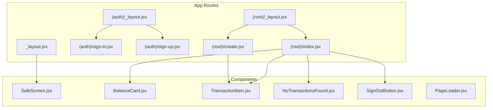
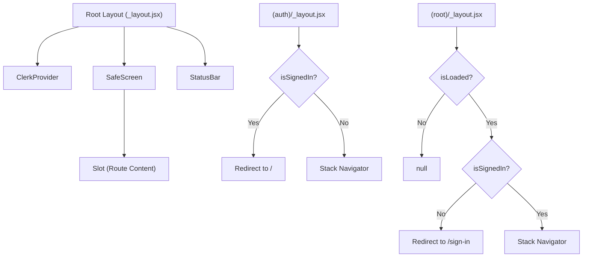
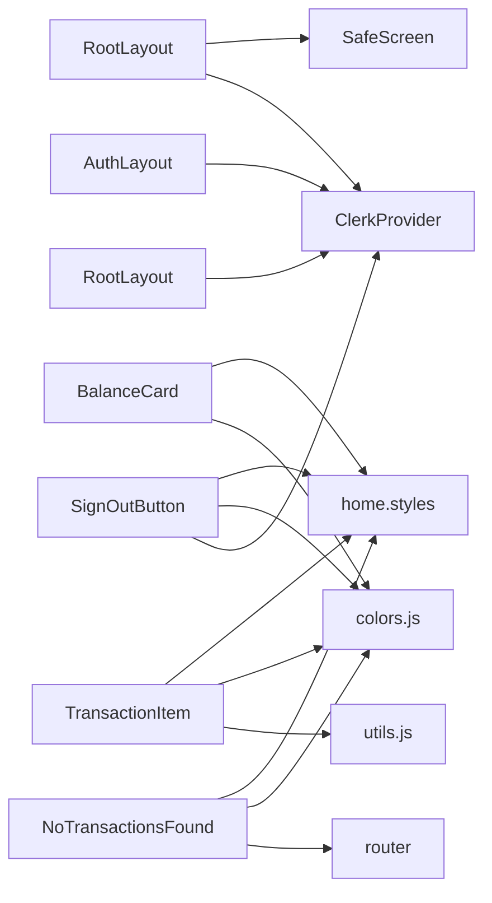

# Component Tree

<cite>
**Referenced Files in This Document**   
- [app/_layout.jsx](file://mobile/app/_layout.jsx#L1-L16)
- [app/(auth)/_layout.jsx](file://mobile/app/(auth)/_layout.jsx#L1-L11)
- [app/(root)/_layout.jsx](file://mobile/app/(root)/_layout.jsx#L1-L12)
- [components/SafeScreen.jsx](file://mobile/components/SafeScreen.jsx#L1-L14)
- [components/BalanceCard.jsx](file://mobile/components/BalanceCard.jsx#L1-L29)
- [components/TransactionItem.jsx](file://mobile/components/TransactionItem.jsx#L1-L45)
- [components/NoTransactionsFound.jsx](file://mobile/components/NoTransactionsFound.jsx#L1-L28)
- [components/SignOutButton.jsx](file://mobile/components/SignOutButton.jsx#L1-L20)
- [app/index.jsx](file://mobile/app/(root)/index.jsx)
- [app/create.jsx](file://mobile/app/(root)/create.jsx)
</cite>

## Table of Contents
1. [Introduction](#introduction)
2. [Project Structure](#project-structure)
3. [Core Components](#core-components)
4. [Architecture Overview](#architecture-overview)
5. [Detailed Component Analysis](#detailed-component-analysis)
6. [Dependency Analysis](#dependency-analysis)
7. [Performance Considerations](#performance-considerations)
8. [Troubleshooting Guide](#troubleshooting-guide)
9. [Conclusion](#conclusion)

## Introduction
This document provides a comprehensive overview of the frontend component hierarchy in the **expense-wallet** mobile application. It details the structure and functionality of key UI components, navigation layout using Expo Router, and authentication flow management. The analysis focuses on how components are organized, their responsibilities, and how they interact to deliver a consistent and accessible user experience across screens.

## Project Structure
The **expense-wallet** mobile application follows a modular and feature-based structure, leveraging Expo Router for file-based routing and component organization. Key directories include:
- `app/`: Contains route definitions and layout files using Expo Router conventions.
- `components/`: Houses reusable UI components.
- `assets/styles/`: Stores modular style sheets.
- `constants/`: Defines shared constants like colors and API endpoints.
- `hooks/`: Custom React hooks for data fetching and state management.
- `lib/`: Utility functions.

Route groups `(auth)` and `(root)` are used to logically separate authenticated and unauthenticated flows, enabling clean navigation gating.



**Diagram sources**
- [app/_layout.jsx](file://mobile/app/_layout.jsx#L1-L16)
- [app/(auth)/_layout.jsx](file://mobile/app/(auth)/_layout.jsx#L1-L11)
- [app/(root)/_layout.jsx](file://mobile/app/(root)/_layout.jsx#L1-L12)
- [components/SafeScreen.jsx](file://mobile/components/SafeScreen.jsx#L1-L14)

**Section sources**
- [app/_layout.jsx](file://mobile/app/_layout.jsx#L1-L16)
- [app/(auth)/_layout.jsx](file://mobile/app/(auth)/_layout.jsx#L1-L11)
- [app/(root)/_layout.jsx](file://mobile/app/(root)/_layout.jsx#L1-L12)

## Core Components
The frontend architecture is built around reusable, self-contained components that promote consistency and maintainability. The root layout enforces global UI constraints via `SafeScreen`, while route groups manage authentication state. Each screen in the `(root)` group renders financial data using `BalanceCard`, `TransactionItem`, and `NoTransactionsFound` components, with `SignOutButton` providing logout functionality.

**Section sources**
- [components/BalanceCard.jsx](file://mobile/components/BalanceCard.jsx#L1-L29)
- [components/TransactionItem.jsx](file://mobile/components/TransactionItem.jsx#L1-L45)
- [components/NoTransactionsFound.jsx](file://mobile/components/NoTransactionsFound.jsx#L1-L28)
- [components/SignOutButton.jsx](file://mobile/components/SignOutButton.jsx#L1-L20)

## Architecture Overview
The application uses Expo Router’s file-based routing with layout wrappers to manage navigation and authentication. The top-level `_layout.jsx` wraps the entire app with `ClerkProvider` for authentication context and `SafeScreen` for consistent padding. Route groups `(auth)` and `(root)` contain their own layout files that redirect users based on authentication status.



**Diagram sources**
- [app/_layout.jsx](file://mobile/app/_layout.jsx#L1-L16)
- [app/(auth)/_layout.jsx](file://mobile/app/(auth)/_layout.jsx#L1-L11)
- [app/(root)/_layout.jsx](file://mobile/app/(root)/_layout.jsx#L1-L12)

## Detailed Component Analysis

### SafeScreen Component
`SafeScreen` is a universal container that ensures content respects device safe areas (e.g., notches, status bars). It uses `react-native-safe-area-context` to dynamically apply padding to the top and bottom of the screen, preventing content from being obscured.

```jsx
const SafeScreen = ({ children }) => {
  const insets = useSafeAreaInsets();
  return (
    <View style={{
      paddingTop: insets.top,
      paddingBottom: insets.bottom,
      flex: 1,
      backgroundColor: COLORS.textLight
    }}>
      {children}
    </View>
  );
};
```

It is used in both the root layout and `(root)` group layout to enforce consistent spacing across all authenticated screens.

**Section sources**
- [components/SafeScreen.jsx](file://mobile/components/SafeScreen.jsx#L1-L14)

### BalanceCard Component
`BalanceCard` displays a financial summary including total balance, income, and expenses. It receives a `summary` object as a prop and formats values with currency symbols and decimal precision.

```jsx
const BalanceCard = ({ summary }) => {
  return (
    <View style={styles.balanceCard}>
      <Text style={styles.balanceTitle}>Total Balance</Text>
      <Text style={styles.balanceAmount}> ₹ {parseFloat(summary.balance).toFixed(2)} </Text>
      <View style={styles.balanceStats}>
        <View style={styles.balanceStatItem}>
          <Text style={[styles.balanceStatLabel, { color: COLORS.income }]}>Income</Text>
          <Text style={[styles.balanceStatAmount, { color: "green" }]}>
            +₹ {parseFloat(summary.income).toFixed(2)}
          </Text>
        </View>
        <View style={[styles.balanceStatItem, styles.statDivider]} />
        <View style={styles.balanceStatItem}>
          <Text style={[styles.balanceStatLabel, { color: COLORS.expense }]}>Expenses</Text>
          <Text style={[styles.balanceStatAmount, { color: "red" }]}>
            -₹ {Math.abs(parseFloat(summary.expense)).toFixed(2)}
          </Text>
        </View>
      </View>
    </View>
  );
};
```

Used in `index.jsx`, it provides a clear visual breakdown of the user’s financial status.

**Section sources**
- [components/BalanceCard.jsx](file://mobile/components/BalanceCard.jsx#L1-L29)

### TransactionItem Component
`TransactionItem` renders an individual transaction with category-based icons, formatted amount, and date. It supports deletion via an `onDelete` callback passed from the parent screen.

```jsx
export const TransactionItem = ({ item, onDelete }) => {
  const isIncome = parseFloat(item.amount) > 0;
  const iconName = CATEGORY_ICONS[item.category] || "pricetag-outline";

  return (
    <View style={styles.transactionCard}>
      <TouchableOpacity style={styles.transactionContent}>
        <View style={styles.categoryIconContainer}>
          <Ionicons name={iconName} size={22} color={isIncome ? COLORS.income : COLORS.expense} />
        </View>
        <View style={styles.transactionLeft}>
          <Text style={styles.transactionTitle}>{item.title}</Text>
          <Text style={styles.transactionCategory}>{item.category}</Text>
        </View>
        <View style={styles.transactionRight}>
          <Text style={[styles.transactionAmount, { color: isIncome ? COLORS.income : COLORS.expense }]}>
            {isIncome ? "+" : "-"}₹{Math.abs(parseFloat(item.amount)).toFixed(2)}
          </Text>
          <Text style={styles.transactionDate}>{formatDate(item.created_at)}</Text>
        </View>
      </TouchableOpacity>
      <TouchableOpacity style={styles.deleteButton} onPress={() => onDelete(item.id)}>
        <Ionicons name="trash-outline" size={20} color={COLORS.expense} />
      </TouchableOpacity>
    </View>
  );
};
```

Used in both `index.jsx` and `create.jsx`, it ensures consistent transaction rendering.

**Section sources**
- [components/TransactionItem.jsx](file://mobile/components/TransactionItem.jsx#L1-L45)

### NoTransactionsFound Component
`NoTransactionsFound` handles the empty state when no transactions exist. It displays a message and a button to navigate to the create transaction screen.

```jsx
const NoTransactionsFound = () => {
  const router = useRouter();
  return (
    <View style={styles.emptyState}>
      <Ionicons name="receipt-outline" size={60} color={COLORS.textLight} />
      <Text style={styles.emptyStateTitle}>No transactions yet</Text>
      <Text style={styles.emptyStateText}>
        Start tracking your finances by adding your first transaction
      </Text>
      <TouchableOpacity style={styles.emptyStateButton} onPress={() => router.push("/create")}>
        <Ionicons name="add-circle" size={18} color={COLORS.white} />
        <Text style={styles.emptyStateButtonText}>Add Transaction</Text>
      </TouchableOpacity>
    </View>
  );
};
```

This component improves UX by guiding users toward the next action.

**Section sources**
- [components/NoTransactionsFound.jsx](file://mobile/components/NoTransactionsFound.jsx#L1-L28)

### SignOutButton Component
`SignOutButton` provides a secure logout mechanism using Clerk’s `signOut()` function, wrapped in a confirmation alert to prevent accidental logouts.

```jsx
export const SignOutButton = () => {
  const { signOut } = useClerk();
  const handleSignOut = async () => {
    Alert.alert("Logout", "Are you sure you want to logout?", [
      { text: "Cancel", style: "cancel" },
      { text: "Logout", style: "destructive", onPress: signOut }
    ]);
  };
  return (
    <TouchableOpacity style={styles.logoutButton} onPress={handleSignOut}>
      <Ionicons name="log-out-outline" size={22} color={COLORS.text} />
    </TouchableOpacity>
  );
};
```

Used in authenticated screens, it ensures secure session termination.

**Section sources**
- [components/SignOutButton.jsx](file://mobile/components/SignOutButton.jsx#L1-L20)

## Dependency Analysis
The component hierarchy demonstrates low coupling and high cohesion. `SafeScreen` is a layout utility used globally. `BalanceCard`, `TransactionItem`, and `NoTransactionsFound` are presentation components dependent only on style modules and constants. `SignOutButton` depends on Clerk for authentication state.



**Diagram sources**
- [app/_layout.jsx](file://mobile/app/_layout.jsx#L1-L16)
- [components/BalanceCard.jsx](file://mobile/components/BalanceCard.jsx#L1-L29)
- [components/TransactionItem.jsx](file://mobile/components/TransactionItem.jsx#L1-L45)
- [components/NoTransactionsFound.jsx](file://mobile/components/NoTransactionsFound.jsx#L1-L28)
- [components/SignOutButton.jsx](file://mobile/components/SignOutButton.jsx#L1-L20)

**Section sources**
- [components/BalanceCard.jsx](file://mobile/components/BalanceCard.jsx#L1-L29)
- [components/TransactionItem.jsx](file://mobile/components/TransactionItem.jsx#L1-L45)
- [components/NoTransactionsFound.jsx](file://mobile/components/NoTransactionsFound.jsx#L1-L28)
- [components/SignOutButton.jsx](file://mobile/components/SignOutButton.jsx#L1-L20)

## Performance Considerations
- `SafeScreen` uses `useSafeAreaInsets` efficiently, recalculating only when insets change.
- `TransactionItem` uses `parseFloat` and `toFixed` for display formatting, which should be memoized in large lists.
- `SignOutButton` uses synchronous `Alert.alert`, which blocks UI but is acceptable for critical actions.
- All components use inline styles from imported modules, which React Native optimizes.

## Troubleshooting Guide
- **Safe area not applied**: Ensure `SafeScreen` wraps all screen content.
- **Authentication redirect loop**: Verify `isSignedIn` and `isLoaded` checks in `(root)/_layout.jsx`.
- **Icons not rendering**: Confirm `@expo/vector-icons` is installed and linked.
- **Currency formatting issues**: Check that `amount` values are strings or numbers parsable by `parseFloat`.
- **Delete button not working**: Ensure `onDelete` callback is passed correctly from parent.

**Section sources**
- [app/(root)/_layout.jsx](file://mobile/app/(root)/_layout.jsx#L1-L12)
- [components/TransactionItem.jsx](file://mobile/components/TransactionItem.jsx#L1-L45)
- [components/SignOutButton.jsx](file://mobile/components/SignOutButton.jsx#L1-L20)

## Conclusion
The **expense-wallet** frontend employs a clean, modular architecture with reusable components and clear separation of concerns. Expo Router and Clerk enable robust navigation and authentication, while `SafeScreen` ensures consistent UI across devices. Developers can extend the UI by reusing components like `BalanceCard` and `TransactionItem` in new screens, following the established patterns for styling, accessibility, and data flow.