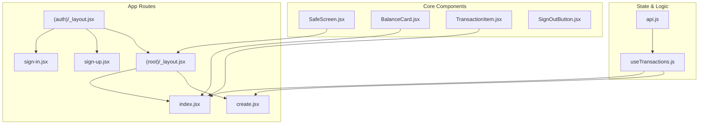
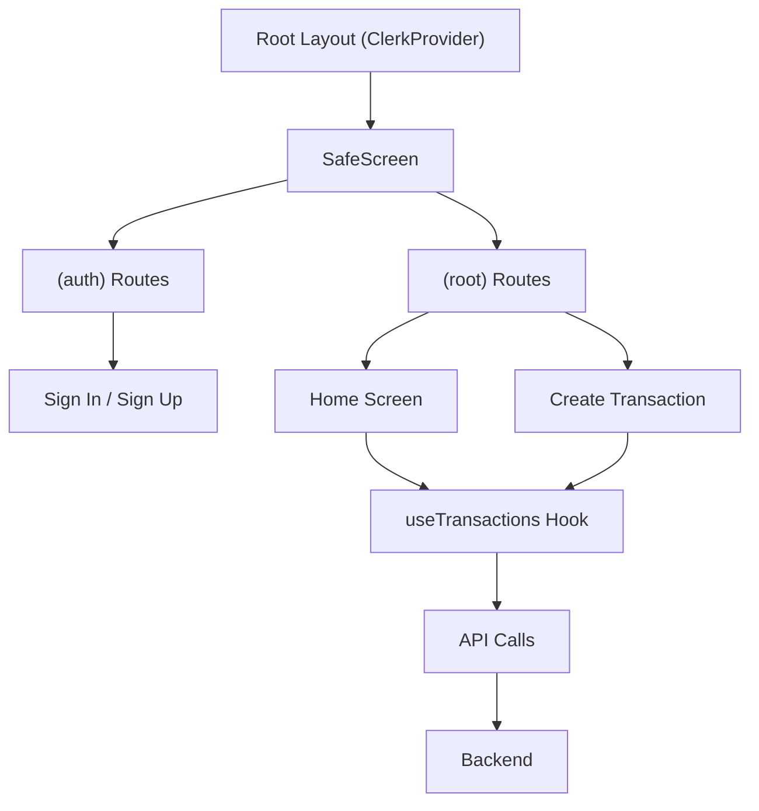
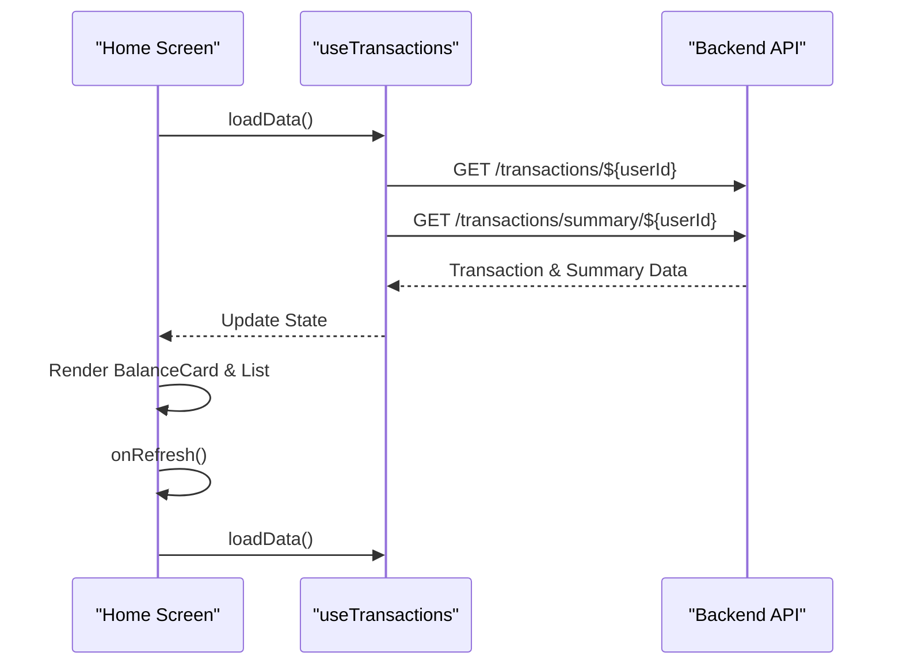
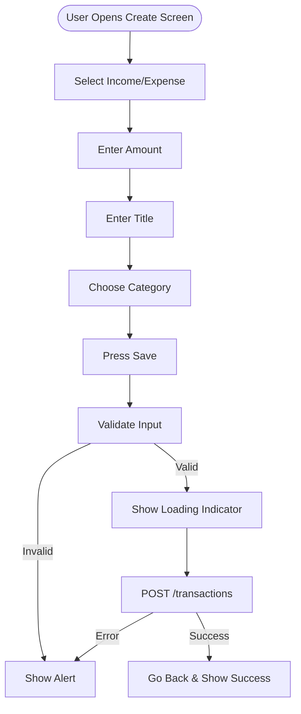
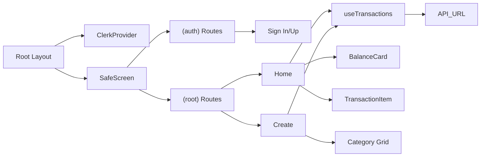

# Frontend Architecture

<cite>
**Referenced Files in This Document**   
- [app/_layout.jsx](file://app/_layout.jsx#L1-L16)
- [app/(auth)/_layout.jsx](file://app/(auth)/_layout.jsx#L1-L11)
- [app/(root)/_layout.jsx](file://app/(root)/_layout.jsx#L1-L12)
- [components/SafeScreen.jsx](file://components/SafeScreen.jsx#L1-L14)
- [hooks/useTransactions.js](file://hooks/useTransactions.js#L1-L70)
- [app/(root)/index.jsx](file://app/(root)/index.jsx#L1-L109)
- [app/(root)/create.jsx](file://app/(root)/create.jsx#L1-L202)
- [components/BalanceCard.jsx](file://components/BalanceCard.jsx#L1-L29)
- [components/TransactionItem.jsx](file://components/TransactionItem.jsx)
- [components/SignOutButton.jsx](file://components/SignOutButton.jsx)
- [constants/api.js](file://constants/api.js)
- [app.json](file://app.json#L1-L42)
</cite>

## Table of Contents
1. [Introduction](#introduction)
2. [Project Structure](#project-structure)
3. [Core Components](#core-components)
4. [Architecture Overview](#architecture-overview)
5. [Detailed Component Analysis](#detailed-component-analysis)
6. [Dependency Analysis](#dependency-analysis)
7. [Performance Considerations](#performance-considerations)
8. [Troubleshooting Guide](#troubleshooting-guide)
9. [Conclusion](#conclusion)

## Introduction
This document provides a comprehensive overview of the frontend architecture for the **expense-wallet** mobile application. Built using Expo and React Native, the app leverages **expo-router** for navigation and **Clerk** for authentication. The architecture is structured around route groups to manage authentication flow and protected routes, ensuring a secure and seamless user experience. This documentation details the component hierarchy, state management, styling strategy, and data flow, enabling developers to understand, modify, and extend the application effectively.

## Project Structure
The mobile frontend is organized using a feature-based structure with clear separation of concerns. Key directories include:
- `app/`: Contains all screen components and route configurations using Expo Router.
- `components/`: Reusable UI components.
- `hooks/`: Custom React hooks for data fetching and state logic.
- `constants/`: Shared configuration values like API endpoints and colors.
- `assets/styles`: Modular style sheets for different screens.

Route groups `(auth)` and `(root)` are used to separate unauthenticated and authenticated navigation flows.



**Diagram sources**
- [app/_layout.jsx](file://app/_layout.jsx#L1-L16)
- [app/(auth)/_layout.jsx](file://app/(auth)/_layout.jsx#L1-L11)
- [app/(root)/_layout.jsx](file://app/(root)/_layout.jsx#L1-L12)
- [components/SafeScreen.jsx](file://components/SafeScreen.jsx#L1-L14)
- [hooks/useTransactions.js](file://hooks/useTransactions.js#L1-L70)

**Section sources**
- [app/_layout.jsx](file://app/_layout.jsx#L1-L16)
- [app/(auth)/_layout.jsx](file://app/(auth)/_layout.jsx#L1-L11)
- [app/(root)/_layout.jsx](file://app/(root)/_layout.jsx#L1-L12)

## Core Components
The application's UI is built from a hierarchy of reusable components, starting with `SafeScreen` as the base container. This ensures consistent padding across devices with notches or status bars. Key components include:
- **BalanceCard**: Displays financial summary (balance, income, expenses).
- **TransactionItem**: Renders individual transaction entries.
- **SignOutButton**: Provides logout functionality within protected routes.
- **PageLoader**: Shows loading state during data fetch.

These components are used across screens to maintain visual consistency and reduce code duplication.

**Section sources**
- [components/BalanceCard.jsx](file://components/BalanceCard.jsx#L1-L29)
- [components/TransactionItem.jsx](file://components/TransactionItem.jsx)
- [components/SignOutButton.jsx](file://components/SignOutButton.jsx)
- [components/PageLoader.jsx](file://components/PageLoader.jsx)

## Architecture Overview
The application uses **Expo Router** with route groups to manage navigation and authentication state. The root `_layout.jsx` wraps the entire app with `ClerkProvider`, enabling global access to authentication context. Route groups `(auth)` and `(root)` enforce access control:
- `(auth)` routes are only accessible when the user is signed out.
- `(root)` routes require authentication and redirect to sign-in if not authenticated.

Data is managed via a custom hook `useTransactions.js`, which handles fetching, refreshing, and mutating transaction data through REST API calls.



**Diagram sources**
- [app/_layout.jsx](file://app/_layout.jsx#L1-L16)
- [app/(auth)/_layout.jsx](file://app/(auth)/_layout.jsx#L1-L11)
- [app/(root)/_layout.jsx](file://app/(root)/_layout.jsx#L1-L12)
- [hooks/useTransactions.js](file://hooks/useTransactions.js#L1-L70)

## Detailed Component Analysis

### Root Layout and Authentication Flow
The root `_layout.jsx` initializes the app with `ClerkProvider`, which manages authentication state and token caching. It wraps all screens with `SafeScreen` for consistent layout and includes `StatusBar` for appearance control.

```jsx
<ClerkProvider tokenCache={tokenCache}>
  <SafeScreen>
    <Slot />
  </SafeScreen>
  <StatusBar style="dark" />
</ClerkProvider>
```

The `(auth)/_layout.jsx` checks if the user is already signed in and redirects to the home screen if true. Otherwise, it renders the authentication stack without headers.

```jsx
const { isSignedIn } = useAuth();
if (isSignedIn) return <Redirect href={'/'} />;
return <Stack screenOptions={{headerShown:false}}/>
```

Similarly, `(root)/_layout.jsx` ensures only authenticated users can access protected routes.

**Section sources**
- [app/_layout.jsx](file://app/_layout.jsx#L1-L16)
- [app/(auth)/_layout.jsx](file://app/(auth)/_layout.jsx#L1-L11)
- [app/(root)/_layout.jsx](file://app/(root)/_layout.jsx#L1-L12)

### SafeScreen Component
`SafeScreen.jsx` uses `useSafeAreaInsets` from `react-native-safe-area-context` to apply dynamic padding based on device insets (status bar, notch, home indicator). It ensures content is not obscured by native UI elements.

```jsx
<View style={{
  paddingTop: insets.top,
  paddingBottom: insets.bottom,
  flex: 1,
  backgroundColor: COLORS.textLight
}}>
  {children}
</View>
```

**Section sources**
- [components/SafeScreen.jsx](file://components/SafeScreen.jsx#L1-L14)

### useTransactions Custom Hook
This hook encapsulates all transaction-related data logic:
- Fetches transactions and summary via API.
- Manages loading state.
- Provides `deleteTransaction` mutation.
- Uses `useCallback` for performance optimization.

Key functions:
- `fetchTransactions()`: Gets all transactions for a user.
- `fetchSummary()`: Retrieves balance, income, and expense totals.
- `loadData()`: Runs both fetches in parallel.
- `deleteTransaction(id)`: Deletes a transaction and refreshes data.

```jsx
export const useTransactions = (userId) => {
  const [transactions, setTransactions] = useState([]);
  const [summary, setSummary] = useState({ balance: 0, income: 0, expense: 0 });
  const [isLoading, setIsLoading] = useState(true);

  const fetchTransactions = useCallback(async () => { ... }, [userId]);
  const fetchSummary = useCallback(async () => { ... }, [userId]);

  const loadData = useCallback(async () => {
    setIsLoading(true);
    await Promise.all([fetchTransactions(), fetchSummary()]);
    setIsLoading(false);
  }, [fetchTransactions, fetchSummary, userId]);

  const deleteTransaction = async (id) => {
    await fetch(`${API_URL}/transactions/${id}`, { method: "DELETE" });
    loadData();
  };

  return { transactions, summary, isLoading, loadData, deleteTransaction };
};
```

**Section sources**
- [hooks/useTransactions.js](file://hooks/useTransactions.js#L1-L70)

### Home Screen (index.jsx)
The home screen displays the user's financial overview:
- Shows a welcome message with username.
- Renders `BalanceCard` with summary data.
- Lists recent transactions using `FlatList` for performance.
- Includes pull-to-refresh via `RefreshControl`.
- Uses `NoTransactionsFound` as fallback when no data exists.

It uses `useTransactions(user.id)` to load data on mount and supports transaction deletion via confirmation alert.



**Diagram sources**
- [app/(root)/index.jsx](file://app/(root)/index.jsx#L1-L109)
- [hooks/useTransactions.js](file://hooks/useTransactions.js#L1-L70)

### Create Transaction Screen (create.jsx)
This screen allows users to add new transactions:
- Lets users choose between income and expense.
- Accepts title, amount, and category.
- Formats amount as negative (expense) or positive (income).
- Sends POST request to create transaction.
- Shows loading indicator during submission.

Category selection is implemented as a grid of touchable buttons.



**Diagram sources**
- [app/(root)/create.jsx](file://app/(root)/create.jsx#L1-L202)
- [constants/api.js](file://constants/api.js)

## Dependency Analysis
The application has a clean dependency structure:
- UI components depend only on styles and core React Native elements.
- `useTransactions` depends on `API_URL` from `constants/api.js`.
- Screens depend on hooks and components, not directly on API.
- Authentication is abstracted via Clerk hooks.



**Diagram sources**
- [app/_layout.jsx](file://app/_layout.jsx#L1-L16)
- [hooks/useTransactions.js](file://hooks/useTransactions.js#L1-L70)
- [constants/api.js](file://constants/api.js)

**Section sources**
- [app/_layout.jsx](file://app/_layout.jsx#L1-L16)
- [hooks/useTransactions.js](file://hooks/useTransactions.js#L1-L70)
- [constants/api.js](file://constants/api.js)

## Performance Considerations
- **FlatList**: Used for efficient rendering of transaction lists.
- **useCallback**: Memoizes functions in `useTransactions` to prevent unnecessary re-renders.
- **Parallel Data Fetching**: `Promise.all` loads transactions and summary simultaneously.
- **Token Caching**: Clerk's `tokenCache` improves authentication performance.
- **Conditional Rendering**: Loading state is handled gracefully with `PageLoader`.

Avoiding inline function definitions in render props helps maintain performance.

## Troubleshooting Guide
Common issues and solutions:
- **Blank Screen on Launch**: Ensure `ClerkProvider` is at the root and `tokenCache` is defined.
- **Transactions Not Loading**: Verify `userId` is passed correctly to `useTransactions`.
- **API Connection Errors**: Check `API_URL` in `constants/api.js` matches backend address.
- **Category Not Saving**: Ensure category name (not ID) is sent in POST body.
- **Styling Issues**: Confirm `styles` are imported correctly from respective `.styles.js` files.

Use `console.error` logs in `useTransactions.js` to debug API failures.

**Section sources**
- [hooks/useTransactions.js](file://hooks/useTransactions.js#L1-L70)
- [constants/api.js](file://constants/api.js)

## Conclusion
The **expense-wallet** frontend is a well-structured Expo application that effectively separates concerns using route groups, custom hooks, and reusable components. Authentication is seamlessly integrated via Clerk, and data management is centralized in `useTransactions`. The use of Expo Router, safe area handling, and modular styling ensures a robust and maintainable codebase. Developers can extend functionality by following existing patterns for new screens or hooks.