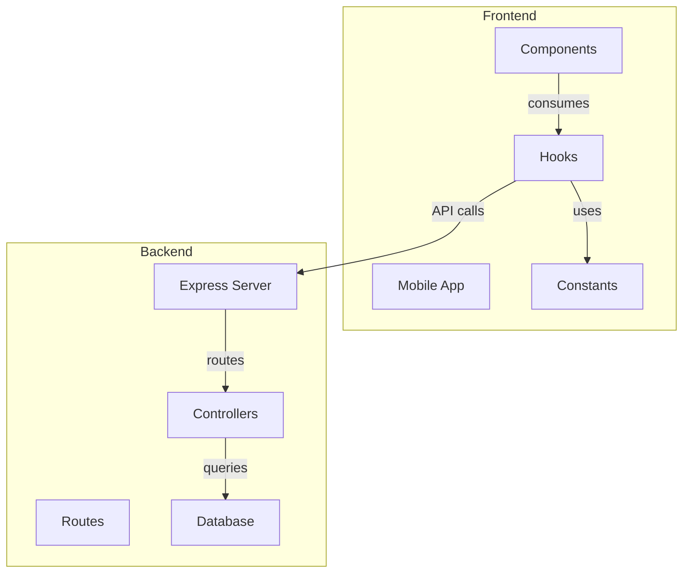
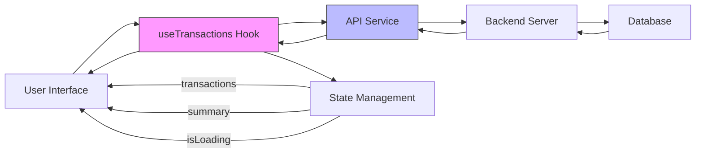
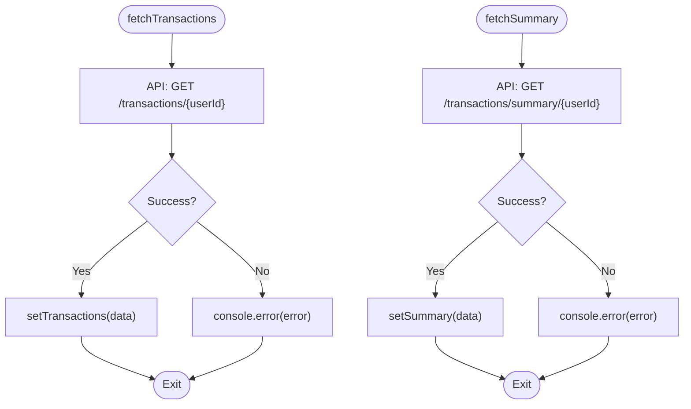
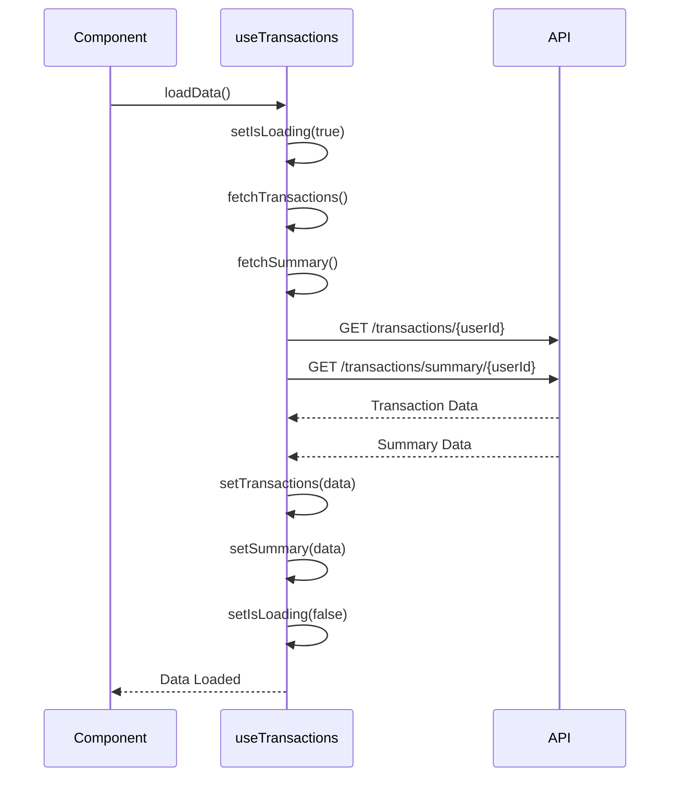
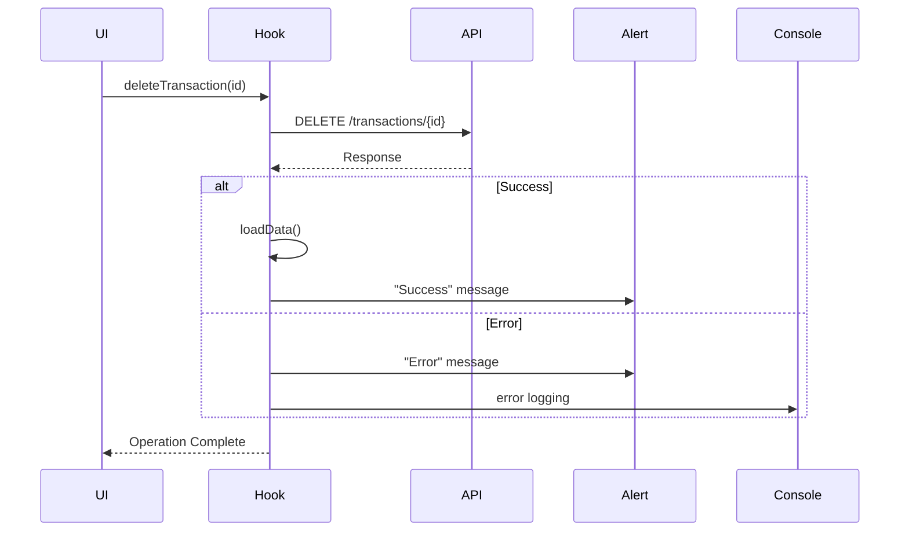
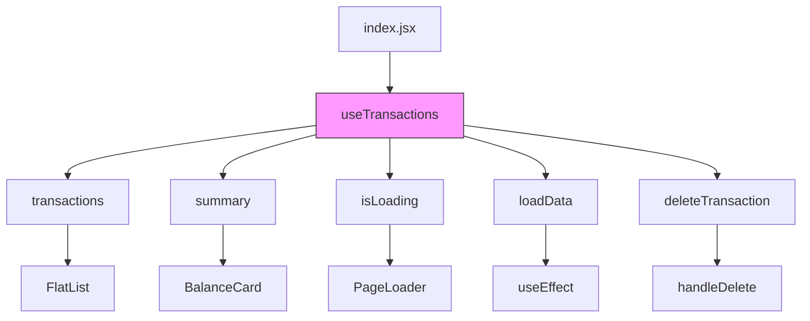
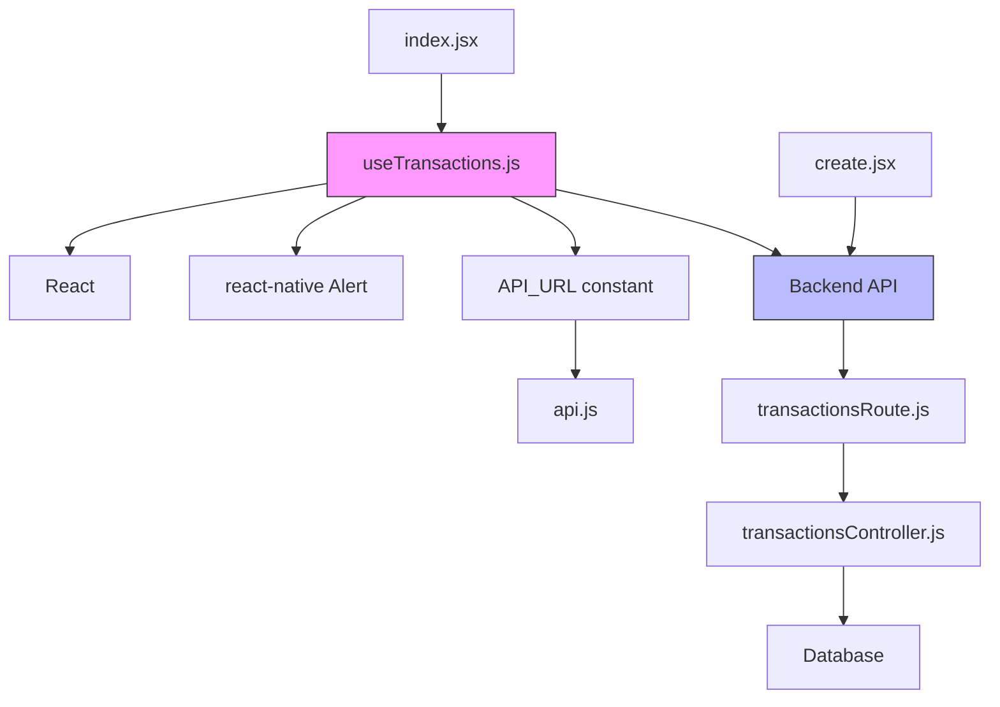

# State Management

<cite>
**Referenced Files in This Document**   
- [useTransactions.js](file://mobile/hooks/useTransactions.js#L1-L70)
- [index.jsx](file://mobile/app/(root)/index.jsx#L1-L109)
- [create.jsx](file://mobile/app/(root)/create.jsx#L1-L202)
- [transactionsRoute.js](file://backend/src/routes/transactionsRoute.js#L1-L13)
- [transactionsController.js](file://backend/src/controllers/transactionsController.js#L1-L90)
- [api.js](file://mobile/constants/api.js#L1-L11)
</cite>

## Table of Contents
1. [Introduction](#introduction)
2. [Project Structure](#project-structure)
3. [Core Components](#core-components)
4. [Architecture Overview](#architecture-overview)
5. [Detailed Component Analysis](#detailed-component-analysis)
6. [Dependency Analysis](#dependency-analysis)
7. [Performance Considerations](#performance-considerations)
8. [Troubleshooting Guide](#troubleshooting-guide)
9. [Conclusion](#conclusion)

## Introduction
This document provides comprehensive documentation for the state management system in the expense-wallet frontend application. The focus is on the custom `useTransactions` hook, which manages all transaction-related data operations including fetching, caching, and mutation. The hook leverages React's `useState` and `useCallback` hooks to maintain state consistency and optimize performance. It encapsulates API interactions for retrieving transactions and summary data, creating new transactions, and deleting existing ones via HTTP DELETE requests. This documentation details the internal state structure, error handling mechanisms, loading states, and integration patterns with UI components such as `index.jsx` and `create.jsx`. The goal is to enable developers to understand the data flow, extend functionality, and troubleshoot state-related issues effectively.

## Project Structure
The expense-wallet project follows a modular architecture with clear separation between frontend and backend components. The mobile frontend is built using React Native with Expo, while the backend uses Node.js with Express. The state management logic resides in the frontend's hooks directory, specifically in the `useTransactions.js` file, which serves as the central point for transaction data handling.



**Diagram sources**
- [useTransactions.js](file://mobile/hooks/useTransactions.js#L1-L70)
- [transactionsRoute.js](file://backend/src/routes/transactionsRoute.js#L1-L13)

**Section sources**
- [useTransactions.js](file://mobile/hooks/useTransactions.js#L1-L70)
- [transactionsRoute.js](file://backend/src/routes/transactionsRoute.js#L1-L13)

## Core Components
The core state management component in the expense-wallet application is the `useTransactions` custom hook. This hook manages transaction data through a combination of React state and memoized callback functions. It maintains three primary state variables: `transactions` (array of transaction records), `summary` (object containing balance, income, and expense totals), and `isLoading` (boolean flag for loading state). The hook provides methods for loading data (`loadData`), deleting transactions (`deleteTransaction`), and automatically fetches data when initialized with a user ID. The implementation uses `useCallback` to prevent unnecessary re-renders and ensure consistent function references across component re-renders.

**Section sources**
- [useTransactions.js](file://mobile/hooks/useTransactions.js#L1-L70)

## Architecture Overview
The state management architecture follows a unidirectional data flow pattern where the `useTransactions` hook acts as a centralized data provider for transaction-related information. Components consume this data through React's hook system, ensuring consistent state across the application. The architecture integrates with the backend API through standardized REST endpoints, with proper error handling and loading state coordination.



**Diagram sources**
- [useTransactions.js](file://mobile/hooks/useTransactions.js#L1-L70)
- [transactionsController.js](file://backend/src/controllers/transactionsController.js#L1-L90)

## Detailed Component Analysis

### useTransactions Hook Analysis
The `useTransactions` hook is the cornerstone of the application's state management system. It initializes with three state variables: `transactions` (empty array), `summary` (with balance, income, and expense set to 0), and `isLoading` (set to true initially). The hook accepts a `userId` parameter which is essential for data fetching operations.

#### State Initialization and Structure
```javascript
const [transactions, setTransactions] = useState([]);
const [summary, setSummary] = useState({
  balance: 0,
  income: 0,
  expense: 0,
});
const [isLoading, setIsLoading] = useState(true);
```

The state structure is designed to hold:
- **transactions**: Array of transaction objects retrieved from the backend
- **summary**: Object containing financial summary data (total balance, income, and expenses)
- **isLoading**: Boolean flag to manage loading states during API operations

#### Data Fetching Methods
The hook implements two primary data fetching functions using `useCallback` for performance optimization:



**Diagram sources**
- [useTransactions.js](file://mobile/hooks/useTransactions.js#L15-L35)

#### Data Loading Sequence
The `loadData` function orchestrates the initialization process by concurrently fetching both transactions and summary data:



**Diagram sources**
- [useTransactions.js](file://mobile/hooks/useTransactions.js#L37-L50)

#### Transaction Deletion Workflow
The `deleteTransaction` method handles removal of transactions with proper error handling and user feedback:



**Diagram sources**
- [useTransactions.js](file://mobile/hooks/useTransactions.js#L52-L68)
- [transactionsController.js](file://backend/src/controllers/transactionsController.js#L41-L55)

**Section sources**
- [useTransactions.js](file://mobile/hooks/useTransactions.js#L1-L70)

### Component Integration Analysis
The `useTransactions` hook is consumed by key UI components to display and manipulate transaction data.

#### Home Screen Integration (index.jsx)
The home screen component uses the hook to display transaction lists and summary information:



Key integration points:
- **Data Loading**: Uses `useEffect` with `loadData` for initial data fetch
- **Refresh Control**: Implements pull-to-refresh using `onRefresh` function
- **Conditional Rendering**: Shows `PageLoader` during initial loading state
- **Transaction Deletion**: Integrates with confirmation dialog before deletion

**Section sources**
- [index.jsx](file://mobile/app/(root)/index.jsx#L1-L109)

#### Create Transaction Integration (create.jsx)
While the create screen doesn't directly use `useTransactions`, it interacts with the same API endpoints to create new transactions, which are then reflected when the home screen reloads data:

```javascript
// In create.jsx - transaction creation
const response = await fetch(`${API_URL}/transactions`, {
  method: "POST",
  headers: { "Content-Type": "application/json" },
  body: JSON.stringify({
    user_id: user.id,
    title,
    amount: formattedAmount,
    category: selectedCategory
  }),
});
```

This creates a synchronized data flow where:
1. User creates transaction in `create.jsx`
2. Transaction is sent to backend API
3. Upon successful creation, user navigates back
4. Home screen's `loadData` refreshes the transaction list
5. New transaction appears in the list

**Section sources**
- [create.jsx](file://mobile/app/(root)/create.jsx#L1-L202)

## Dependency Analysis
The state management system has well-defined dependencies between components, hooks, and external services.



**Diagram sources**
- [useTransactions.js](file://mobile/hooks/useTransactions.js#L1-L70)
- [api.js](file://mobile/constants/api.js#L1-L11)
- [transactionsRoute.js](file://backend/src/routes/transactionsRoute.js#L1-L13)

**Section sources**
- [useTransactions.js](file://mobile/hooks/useTransactions.js#L1-L70)
- [api.js](file://mobile/constants/api.js#L1-L11)

## Performance Considerations
The `useTransactions` hook implements several performance optimizations:

1. **useCallback Memoization**: All functions are wrapped in `useCallback` to prevent unnecessary re-creations on each render, which helps maintain referential equality and prevents downstream components from re-rendering unnecessarily.

2. **Concurrent Data Loading**: The `loadData` function uses `Promise.all()` to fetch transactions and summary data simultaneously, reducing total loading time compared to sequential requests.

3. **Efficient State Updates**: The hook only updates state when data is successfully retrieved, minimizing unnecessary re-renders.

4. **Loading State Management**: The `isLoading` flag provides clear feedback to users during data operations and prevents race conditions by ensuring only one loading operation occurs at a time.

5. **Automatic Revalidation**: After deleting a transaction, the hook automatically calls `loadData()` to refresh the state, ensuring the UI reflects the current data without requiring manual refresh by the user.

These optimizations ensure a responsive user experience even with larger datasets and variable network conditions.

## Troubleshooting Guide
Common issues and their solutions when working with the state management system:

**Issue 1: Data Not Loading**
- **Symptoms**: Empty transaction list, loading spinner persists
- **Causes**: Invalid userId, network connectivity issues, API endpoint unreachable
- **Solutions**: 
  - Verify userId is properly passed to the hook
  - Check API_URL configuration in `api.js`
  - Ensure backend server is running

**Issue 2: Stale Data Display**
- **Symptoms**: Deleted transactions still visible, new transactions not appearing
- **Causes**: `loadData()` not called after mutation, caching issues
- **Solutions**:
  - Ensure `loadData()` is called after create/delete operations
  - Implement proper error handling in API calls

**Issue 3: Multiple Loading States**
- **Symptoms**: Loading state flickers or appears multiple times
- **Causes**: Multiple calls to `loadData()`, improper useEffect dependencies
- **Solutions**:
  - Review useEffect dependency array in consuming components
  - Ensure single source of truth for loading state

**Issue 4: Memory Leaks**
- **Symptoms**: Performance degradation over time
- **Causes**: Unmounted components attempting state updates
- **Solutions**:
  - Implement cleanup functions if needed
  - Use modern React patterns that handle cleanup automatically

**Section sources**
- [useTransactions.js](file://mobile/hooks/useTransactions.js#L1-L70)
- [index.jsx](file://mobile/app/(root)/index.jsx#L1-L109)

## Conclusion
The state management system in the expense-wallet application effectively centralizes transaction data handling through the `useTransactions` custom hook. By encapsulating API interactions, state management, and data transformation logic, the hook provides a clean and consistent interface for consuming components. The architecture promotes reusability, maintainability, and testability while ensuring optimal performance through proper use of React's built-in optimization tools. The integration between frontend components and backend services is well-structured, with clear data flow and error handling mechanisms. This design enables developers to extend functionality, troubleshoot issues efficiently, and maintain a high-quality user experience across different devices and network conditions.