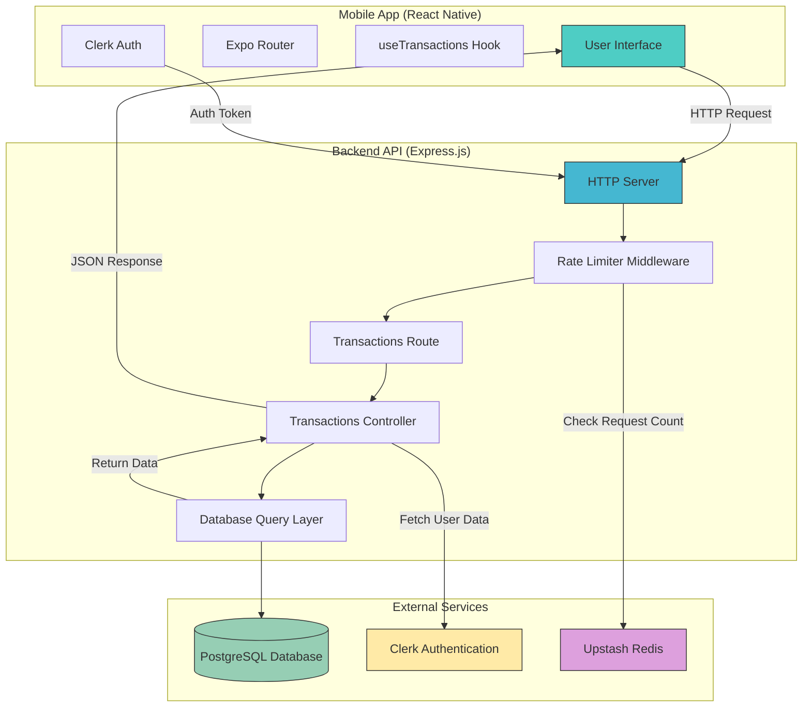
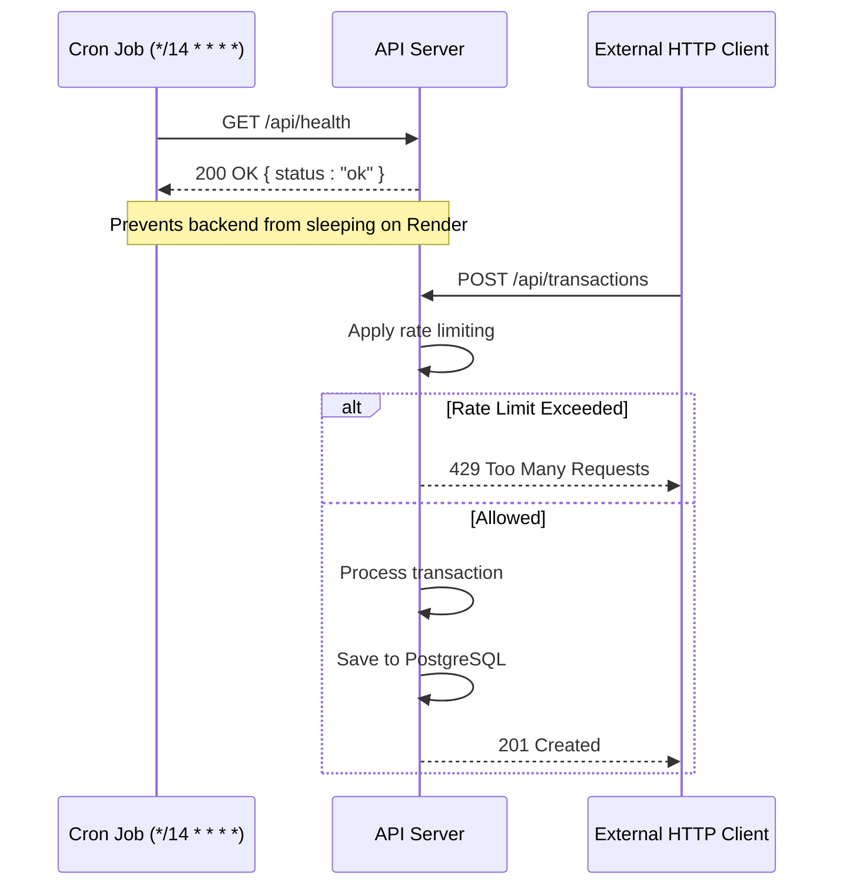

# System Overview

<cite>
**Referenced Files in This Document**   
- [Server.js](file://backend/src/Server.js)
- [db.js](file://backend/src/config/db.js)
- [corns.js](file://backend/src/config/corns.js)
- [upstash.js](file://backend/src/config/upstash.js)
- [rateLimiter.js](file://backend/src/middleware/rateLimiter.js)
- [transactionsRoute.js](file://backend/src/routes/transactionsRoute.js)
- [transactionsController.js](file://backend/src/controllers/transactionsController.js)
- [README.md](file://README.md)
</cite>

## Table of Contents
1. [System Overview](#system-overview)
2. [Core Workflows](#core-workflows)
3. [Data Flow and Architecture](#data-flow-and-architecture)
4. [Deployment and Operational Considerations](#deployment-and-operational-considerations)

## System Overview

The **Expense Wallet** is a full-stack personal finance application designed to help users track their expenses and manage financial transactions efficiently. It enables users to record income and expenditures, categorize transactions, view financial summaries, and monitor their balance—all through a mobile interface. The system is built using a modern tech stack with a clear separation between frontend and backend components.

The application consists of two primary parts:
- **Mobile Frontend**: A React Native (Expo) application providing an intuitive user interface for managing transactions.
- **Backend API Server**: An Express.js server handling data persistence, authentication, and business logic.

User authentication is managed via **Clerk**, which securely handles sign-up, sign-in, and session management. Each transaction is tied to a **userId**, ensuring data isolation between users. The backend communicates with a **PostgreSQL database** hosted on Neon, storing transaction records and user-specific financial data.

Key features include:
- Secure user authentication using Clerk
- Creation, retrieval, updating, and deletion (CRUD) of financial transactions
- Real-time balance calculation and financial summary generation
- Rate limiting to prevent abuse of API endpoints
- Health check endpoint to maintain backend availability on hosting platforms like Render

The system is designed for scalability and reliability, incorporating best practices such as environment-based configuration, connection pooling, and scheduled health pings to avoid service dormancy in production environments.

## Core Workflows

### User Authentication
Users begin by signing up or logging in through the mobile app using **Clerk authentication**. Upon successful authentication, the frontend receives a secure token that is used to identify the user in subsequent API requests. The **userId** extracted from the authentication token is used throughout the system to associate transactions with the correct user.

### Transaction Management
Once authenticated, users can perform the following actions:
- **Create Transactions**: Users input details such as title, amount, and category. This data is sent via a POST request to the backend, where it is validated and stored in the PostgreSQL database.
- **View Transactions**: A GET request retrieves all transactions associated with the authenticated user’s **userId**.
- **Delete Transactions**: Users can remove individual transactions by sending a DELETE request with the transaction ID.
- **Financial Summary**: The system calculates total income, expenses, and net balance dynamically by aggregating transaction data.

### Data Processing Flow
1. The mobile app sends an HTTP request to the Express.js backend.
2. The request passes through middleware, including **rate limiting** using Upstash Redis.
3. The backend routes the request to the appropriate controller function.
4. The controller interacts with the database using SQL queries via the Neon driver.
5. Processed data is returned as JSON to the frontend for display.

This flow ensures secure, efficient, and reliable handling of financial data.

**Section sources**
- [Server.js](file://backend/src/Server.js#L1-L38)
- [transactionsRoute.js](file://backend/src/routes/transactionsRoute.js#L1-L13)
- [transactionsController.js](file://backend/src/controllers/transactionsController.js)
- [db.js](file://backend/src/config/db.js#L1-L27)

## Data Flow and Architecture

The system follows a clean architectural pattern with distinct layers: mobile client, API server, database, and third-party services.

**Diagram sources**
- [Server.js](file://backend/src/Server.js#L1-L38)
- [db.js](file://backend/src/config/db.js#L1-L27)
- [transactionsRoute.js](file://backend/src/routes/transactionsRoute.js#L1-L13)
- [rateLimiter.js](file://backend/src/middleware/rateLimiter.js#L1-L30)

**Section sources**
- [Server.js](file://backend/src/Server.js#L1-L38)
- [db.js](file://backend/src/config/db.js#L1-L27)
- [rateLimiter.js](file://backend/src/middleware/rateLimiter.js#L1-L30)

## Deployment and Operational Considerations

To ensure high availability and prevent the backend from going to sleep on serverless platforms like **Render**, a **health check endpoint** is implemented at `/api/health`. This endpoint returns a simple status message and is designed to be pinged regularly.

A **cron job** is configured to send a GET request to this health endpoint every 14 minutes when the application is running in production mode. This prevents the backend from idling and being suspended due to inactivity.

**Diagram sources**
- [Server.js](file://backend/src/Server.js#L15-L22)
- [corns.js](file://backend/src/config/corns.js#L1-L28)

**Section sources**
- [Server.js](file://backend/src/Server.js#L15-L22)
- [corns.js](file://backend/src/config/corns.js#L1-L28)